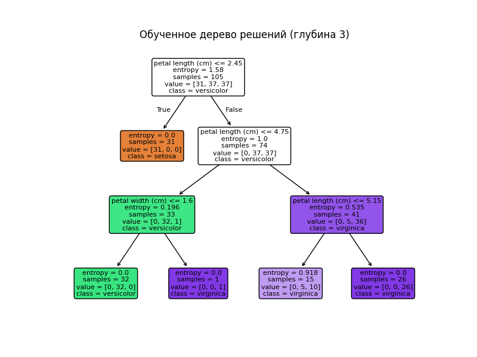
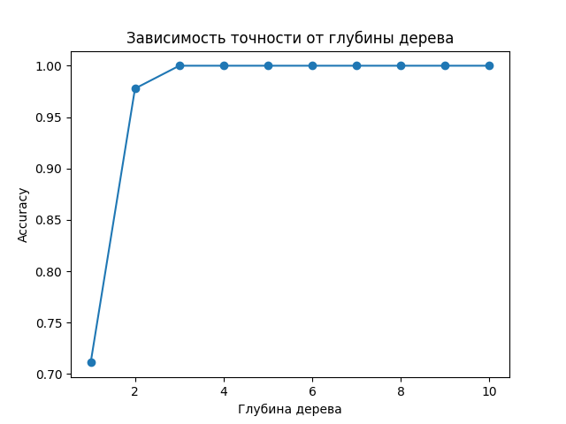

---
## Front matter
lang: ru-RU
title: Доклад «Дерево решений»
subtitle: Машинное обучение
author:
  - Хрусталев Влад Николаевич
institute:
  - Российский университет дружбы народов, Москва, Россия
date: 16 мая 2025

## i18n babel
babel-lang: russian
babel-otherlangs: english

## Formatting pdf
toc: false
toc-title: Содержание
slide_level: 2
aspectratio: 169
section-titles: true
theme: metropolis
header-includes:
 - \metroset{progressbar=frametitle,sectionpage=progressbar,numbering=fraction}
---

## Докладчик

  * **Хрусталев Влад Николаевич**  
  * Группа НПИбд-01-22  
  * Российский университет дружбы народов им. Патриса Лумумбы
  * [1132222011@pfur.ru](mailto:1132222011@pfur.ru)


## Описание модели

Структура дерева представляет собой «листья» и «ветки».  
На ветках записаны атрибуты, от которых зависит целевая функция,  
в листьях — значения целевой функции, а в остальных узлах — признаки.  
Чтобы классифицировать новый объект, спуститесь от корня по веткам до листа.


## Теоретические основы

**Энтропия**:  
$$
H(S) = -\sum_{i=1}^k p_i \log_2 p_i
$$

**Прирост информации**:  
$$
IG(S, A) = H(S) - \sum_{v\in \mathrm{Values}(A)} \tfrac{|S_v|}{|S|}\,H(S_v)
$$

**Индекс Джини**:  
$$
Gini(S) = 1 - \sum_{i=1}^k p_i^2
$$

## Алгоритмы построения

- **ID3** (Quinlan, 1986): энтропия, дискретные признаки.  
- **C4.5** (Quinlan, 1993): пороги для непрерывных, Gain Ratio, пропуски.  
- **CART** (Breiman et al., 1984): бинарные деревья, Гини, регрессия (MSE), прунинг.

## Материалы и методы

- **Датасет:** Iris (150 образцов, 4 признака, 3 класса)  
- **Инструменты:** Python, Scikit-learn, Matplotlib  
- **Процесс:**  
  - Разбиение 70/30 через `train_test_split`  
  - Классификатор `DecisionTreeClassifier(criterion, max_depth)`  
  - Оценка: `classification_report`, `accuracy_score`

## Реализация на Python (часть 1)

```python
from sklearn.datasets import load_iris
from sklearn.model_selection import train_test_split

# Загрузка и разбиение данных
X, y = load_iris(return_X_y=True)
X_train, X_test, y_train, y_test = train_test_split(
    X, y, test_size=0.3, random_state=42
)
```

## Реализация на Python (часть 2)

```python
from sklearn.tree import DecisionTreeClassifier

# Обучение дерева (энтропия, глубина=3)
clf = DecisionTreeClassifier(
    criterion='entropy',
    max_depth=3,
    random_state=42
)
clf.fit(X_train, y_train)
```

## Реализация на Python (часть 3)

```python
from sklearn.metrics import classification_report, accuracy_score

# Предсказание и метрики
y_pred = clf.predict(X_test)
print(classification_report(y_test, y_pred))
print("Accuracy:", accuracy_score(y_test, y_pred))
```

## Реализация на Python (часть 4)

```python
import matplotlib.pyplot as plt
from sklearn.tree import plot_tree

# Визуализация и сохранение
plt.figure(figsize=(8, 6))
plot_tree(
    clf,
    feature_names=load_iris().feature_names,
    class_names=load_iris().target_names,
    filled=True,
    rounded=True
)
plt.savefig("image/1.png")
plt.close()
```

# Реализация на Python (часть 5)

```python
# Точность vs глубина
depths = range(1, 11)
accuracies = [
    DecisionTreeClassifier(max_depth=d, random_state=42)
    .fit(X_train, y_train)
    .score(X_test, y_test)
    for d in depths
]
plt.figure()
plt.plot(depths, accuracies, marker='o')
plt.title("Accuracy vs Depth")
plt.xlabel("Глубина")
plt.ylabel("Accuracy")
plt.savefig("image/2.png")
plt.close()
```

## Результаты - Дерево решений (глубина 3)

{#fig:001 width=50%}

## Результаты - Accuracy vs Depth

{#fig:002 width=50%}

## Вывод

1. Деревья решений просты и интерпретируемы.
2. Важны критерий разбиения и ограничение глубины для борьбы с переобучением.
3. Scikit-learn облегчает реализацию и визуализацию.
4. Для устойчивости и качества рекомендуется использовать ансамбли (Random Forest, GBDT).
