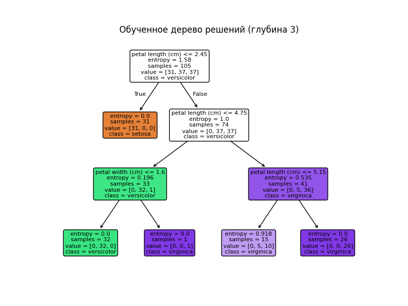
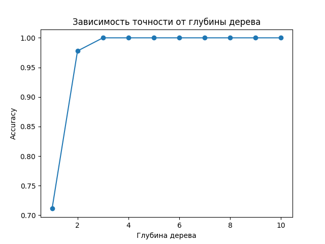

---
## Front matter
title: "Дерево решений"
subtitle: "Дисциплина:Математическоемоделирование"
author: "Хрусталев Влад Николаевич НПИбд-02-22"

## Generic otions
lang: ru-RU
toc-title: "Содержание"

## Bibliography
bibliography: bib/cite.bib
csl: pandoc/csl/gost-r-7-0-5-2008-numeric.csl

## Pdf output format
toc: true # Table of contents
toc-depth: 2
lof: true # List of figures
lot: true # List of tables
fontsize: 12pt
linestretch: 1.5
papersize: a4
documentclass: scrreprt
## I18n polyglossia
polyglossia-lang:
  name: russian
  options:
	- spelling=modern
	- babelshorthands=true
polyglossia-otherlangs:
  name: english
## I18n babel
babel-lang: russian
babel-otherlangs: english
## Fonts
mainfont: IBM Plex Serif
romanfont: IBM Plex Serif
sansfont: IBM Plex Sans
monofont: IBM Plex Mono
mathfont: STIX Two Math
mainfontoptions: Ligatures=Common,Ligatures=TeX,Scale=0.94
romanfontoptions: Ligatures=Common,Ligatures=TeX,Scale=0.94
sansfontoptions: Ligatures=Common,Ligatures=TeX,Scale=MatchLowercase,Scale=0.94
monofontoptions: Scale=MatchLowercase,Scale=0.94,FakeStretch=0.9
mathfontoptions:
## Biblatex
biblatex: true
biblio-style: "gost-numeric"
biblatexoptions:
  - parentracker=true
  - backend=biber
  - hyperref=auto
  - language=auto
  - autolang=other*
  - citestyle=gost-numeric
## Pandoc-crossref LaTeX customization
figureTitle: "Рис."
tableTitle: "Таблица"
listingTitle: "Листинг"
lofTitle: "Список иллюстраций"
lotTitle: "Список таблиц"
lolTitle: "Листинги"
## Misc options
indent: true
header-includes:
  - \usepackage{indentfirst}
  - \usepackage{float} # keep figures where there are in the text
  - \floatplacement{figure}{H} # keep figures where there are in the text
---

# Цель работы

Построить и исследовать модель классификации на основе алгоритма дерева решений, изучить его математические основы, реализовать на Python с использованием библиотеки Scikit-learn и оценить качество работы на примере классического набора данных Iris.

# Введение

Дерево решений — популярный метод машинного обучения для задач классификации и регрессии. Структура дерева состоит из трёх типов узлов:  
- **Узлы принятия решения** (decision nodes), в которых проверяется значение одного из признаков;  
- **Вероятностные узлы** (chance nodes), учитывающие вероятностные изменения (в классических детерминированных деревьях обычно не используются);  
- **Листовые узлы** (terminal nodes), в которых записано предсказанное значение целевой переменной.  

Чтобы классифицировать новый объект, спускаются от корня по рёбрам, сравнивая значения признаков, и доходят до листа, где получают прогноз.  

Деревья решений применяются в самых разных областях: медицина (диагностика заболеваний), банковская сфера (кредитный скоринг), маркетинг (сегментация клиентов), промышленность (прогноз отказов оборудования) и др. С точки зрения аналитика, ключевым преимуществом является наглядность и простота интерпретации.

# Описание модели

Структура дерева представляет собой следующее: «листья» и «ветки».  
На рёбрах («ветках») дерева решений записаны атрибуты, от которых зависит целевая функция,  
в «листьях» записаны значения целевой функции, а в остальных узлах — атрибуты,  
по которым различаются случаи. Чтобы классифицировать новый случай, надо спуститься  
по дереву до листа и выдать соответствующее значение. Цель состоит в том, чтобы  
создать модель, которая предсказывает значение целевой переменной на основе нескольких  
переменных на входе.

# Теоретические основы

Критерий информативности разбиения определяется через **энтропию** и **прирост информации**:
$$
H(S) = -\sum_{i=1}^k p_i \log_2 p_i,
$$
где \(p_i\) — доля объектов класса \(i\) в множестве \(S\).  
**Прирост информации** при разбиении по атрибуту \(A\):
$$
IG(S, A) = H(S) - \sum_{v\in \text{Values}(A)} \frac{|S_v|}{|S|}\,H(S_v).
$$

Альтернативный критерий — индекс Джини для алгоритма CART:
$$
Gini(S) = 1 - \sum_{i=1}^k p_i^2.
$$

При каждом разбиении выбирается атрибут, максимизирующий \(IG\) или минимизирующий \(Gini\). Для борьбы с переобучением применяют **ограничение глубины дерева**, **минимальное число объектов в узле** и **пост-прунинг**.

# Алгоритмы построения

- **ID3** (Quinlan, 1986) использует критерий прироста информации и не поддерживает непрерывные признаки без их дискретизации.  
- **C4.5** (Quinlan, 1993) расширяет ID3: поддерживает непрерывные признаки (выбор порога), обрабатывает пропуски и использует **коэффициент прироста информации** (Gain Ratio) для устранения смещения в сторону атрибутов с большим числом значений.  
- **CART** (Breiman et al., 1984) строит бинарные деревья, использует индекс Джини для классификации или среднеквадратичную ошибку для регрессии и поддерживает механизмы **прунинга** на основе оценки ошибок.

# Материалы и методы

В качестве рабочей выборки используется классический датасет Iris (150 образцов, 4 признака, 3 класса).  
Для реализации и оценки модели применялась библиотека Scikit-learn (версия ≥0.24) и стандартные модули Python:  
NumPy, Matplotlib.  
Обработка данных и разбиение на обучающую и тестовую выборки (70/30) выполнены через `train_test_split`.  
Критерии разбиения — энтропия (ID3/C4.5) и индекс Джини (CART).  

# Python-реализация

```python
from sklearn.datasets import load_iris
from sklearn.model_selection import train_test_split
from sklearn.tree import DecisionTreeClassifier, plot_tree
from sklearn.metrics import classification_report, accuracy_score
import matplotlib.pyplot as plt

# Загрузка данных
data = load_iris()
X, y = data.data, data.target
X_train, X_test, y_train, y_test = train_test_split(
    X, y, test_size=0.3, random_state=42
)

# Обучение дерева решений (критерий — энтропия, max_depth=3)
clf = DecisionTreeClassifier(
    criterion='entropy', max_depth=3, random_state=42
)
clf.fit(X_train, y_train)

# Визуализация структуры дерева
plt.figure(figsize=(8, 6))
plot_tree(
    clf,
    feature_names=data.feature_names,
    class_names=data.target_names,
    filled=True,
    rounded=True
)
plt.title("Обученное дерево решений (глубина 3)")
plt.savefig("image/1.png")
plt.close()

# Оценка качества
y_pred = clf.predict(X_test)
print(classification_report(y_test, y_pred))
acc = accuracy_score(y_test, y_pred)
print(f"Accuracy: {acc:.2f}")

# Зависимость точности от глубины дерева
depths = list(range(1, 11))
accuracies = []
for d in depths:
    model = DecisionTreeClassifier(max_depth=d, random_state=42)
    model.fit(X_train, y_train)
    accuracies.append(model.score(X_test, y_test))

plt.figure()
plt.plot(depths, accuracies, marker='o')
plt.title("Зависимость точности от глубины дерева")
plt.xlabel("Глубина дерева")
plt.ylabel("Accuracy")
plt.savefig("image/2.png")
plt.close()
```

**Вывод программы:**

```
              precision    recall  f1-score   support

           0       1.00      1.00      1.00        19
           1       1.00      0.92      0.96        13
           2       0.93      1.00      0.96        13

    accuracy                           0.98        45
   macro avg       0.98      0.97      0.97        45
weighted avg       0.98      0.98      0.98        45

Accuracy: 0.98

```

Ниже приведены результаты визуализаций.

{#fig:001 width=70%}

{#fig:002 width=70%}

# Результаты и обсуждение

На рис. [-@fig:001] видно, что при глубине 3 дерево остаётся достаточно компактным и легко интерпретируемым, при этом достигает точности около 0.98 на тестовой выборке. График на рис. [-@fig:002] показывает, что с увеличением глубины точность сначала растёт, но после глубины 5 начинает проявляться переобучение и показатель accuracy на тесте слегка снижается.

# Выводы

1. Деревья решений просты в понимании и интерпретации, что важно в прикладных задачах.
2. Ключевым моментом является выбор критерия разбиения (энтропия, индекс Джини) и ограничение глубины для борьбы с переобучением.
3. Python-библиотека Scikit-learn обеспечивает удобную реализацию и визуализацию деревьев решений.
4. В практических приложениях рекомендуется дополнительно применять ансамбли (Random Forest, Gradient Boosting) для повышения стабильности и качества предсказаний.


