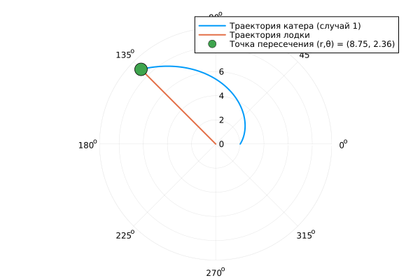
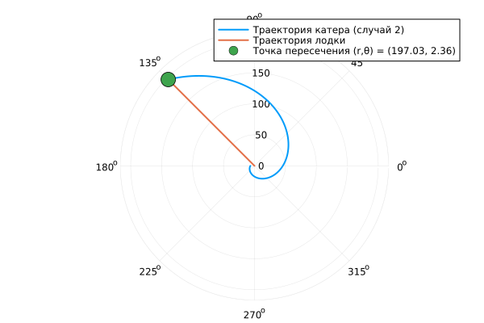

---
## Front matter
lang: ru-RU
title: Лабораторная работа №2
subtitle: Задача о погоне
author:
  - Хрусталев В.Н.
institute:
  - Российский университет дружбы народов, Москва, Россия

## i18n babel
babel-lang: russian
babel-otherlangs: english

## Formatting pdf
toc: false
toc-title: Содержание
slide_level: 2
aspectratio: 169
section-titles: true
theme: metropolis
header-includes:
 - \metroset{progressbar=frametitle,sectionpage=progressbar,numbering=fraction}
---

# Информация

## Докладчик

:::::::::::::: {.columns align=center}
::: {.column width="100%"}

  * Хрусталев Влад Никоалевич
  * студент
  * Российский университет дружбы народов
  * [1132222011@pfur.ru](mailto:1132222011@pfur.ru)
  * <https://vnkhrustalev.github.io/ru/>

::::::::::::::

## Цель работы

Построить математическую модель для выбора правильной стратегии при решении примера задаче о погоне.

## Задание

На море в тумане катер береговой охраны преследует лодку браконьеров. Через определенный промежуток времени туман рассеивается, и лодка обнаруживается на расстоянии 5,9 км от катера. Затем лодка снова скрывается в тумане и уходит прямолинейно в неизвестном направлении. Известно, что скорость катера в 1,9 раза больше скорости браконьерской лодки.

1. Записать уравнение, описывающее движение катера, с начальными условиями для двух случаев (в зависимости от расположения катера относительно лодки в начальный момент времени).

2. Построить траекторию движения катера и лодки для двух случаев.

3. Найти точку пересечения траектории катера и лодки 

## Теоретическое введение

Кривая погони — кривая, представляющая собой решение задачи о «погоне», которая ставится следующим образом. Пусть точка A равномерно движется по некоторой заданной кривой. Требуется найти траекторию равномерного движения точки P такую, что касательная, проведённая к траектории в любой момент движения, проходила бы через соответствующее этому моменту положение точки A 

## Выполнение лабораторной работы

Мой вариант - это (1132222011 % 70) + 1 = 12

## Выполнение лабораторной работы

$$
\dfrac{x}{v} = \dfrac{k-x}{1.9v} \text{ -- в первом случае}
$$
$$
\dfrac{x}{v} = \dfrac{k+x}{1.9v} \text{ -- во втором}
$$

Отсюда мы найдем два значения $x_1 = \dfrac{5.9}{2.9}$ и $x_2 = \dfrac{5.9}{0,9}$, задачу будем решать для двух случаев.

## Выполнение лабораторной работы

$$v_{\tau} = \sqrt{3.61v^2-v^2} = \sqrt{2.61}v$$

Отсюда выводим:

$$
r\dfrac{d \theta}{dt} = \sqrt{2.61}v
$$


## Выполнение лабораторной работы

Решение исходной задачи сводится к решению системы из двух дифференциальных уравнений:

$$\begin{cases}
&\dfrac{dr}{dt} = v\\
&r\dfrac{d \theta}{dt} = \sqrt{2.61}v
\end{cases}$$

## Выполнение лабораторной работы

С начальными условиями для первого случая:

$$\begin{cases}
&{\theta}_0 = 0\\  \tag{1}
&r_0 = \dfrac{5.9}{2.9}
\end{cases}$$

## Выполнение лабораторной работы

Или для второго:

$$\begin{cases}
&{\theta}_0 = -\pi\\  \tag{2}
&r_0 = \dfrac{5.9}{0.9}
\end{cases}$$

## Выполнение лабораторной работы


Исключая из полученной системы производную по $t$, можно перейти к следующему уравнению:
Начальные условия остаются прежними. Решив это уравнение, мы получим траекторию движения катера в полярных координатах.

$$
\dfrac{dr}{d \theta} = \dfrac{r}{\sqrt{2.61}}
$$

## Построение модели / Программы

```Julia
using DifferentialEquations, Plots, Printf

# Параметры задачи
k = 5.9            # расстояние от лодки до катера при обнаружении (км)
n = 1.9            # отношение скоростей: скорость катера = n * скорость лодки
α = sqrt(n^2 - 1)  # α = sqrt(2.61) ≈ 1.616
fi = 3*pi/4        # направление движения лодки (радианы)
v = 1.0            # скорость лодки (единица, для построения графика)

# Определяем ОДУ для фазового уравнения движения катера:
# Решаем уравнение: dr/dθ = r / α
# Здесь u = r, независимая переменная обозначена как θ.
f(u, p, t) = u / α  # функция с тремя аргументами
```

## Построение модели / Программы

```Julia
########################################################################
# СЛУЧАЙ 1
########################################################################

# Начальные условия: катер начинает поворот с r = k/2.9 при θ = 0
r0_case1 = k / 2.9
θspan1 = (0.0, fi)

prob1 = ODEProblem(f, r0_case1, θspan1)
sol1 = solve(prob1, saveat=0.01)

# В точке θ = fi получаем радиус пересечения
r_int1 = sol1.u[end]

# Траектория лодки: движется вдоль постоянного угла fi, радиус равен r = t (при v=1)
t_vals = 0:0.01:r_int1
θ_boat = fill(fi, length(t_vals))
r_boat = t_vals
```

## Построение модели / Программы

```Julia
# Формируем строку с рассчитанными значениями точки пересечения
intersection_label1 = @sprintf("Точка пересечения (r,θ) = (%.2f, %.2f)", r_int1, fi)

# Построение графика (случай 1)
plt1 = plot(sol1.t, sol1.u, proj=:polar, lw=2,
    label="Траектория катера (случай 1)")
plot!(θ_boat, r_boat, proj=:polar, lw=2,
    label="Траектория лодки")
scatter!([fi], [r_int1], marker=(:circle, 10),
    label=intersection_label1)
savefig(plt1, "lab2_01.png")
```

## Построение модели / Программы

```Julia
########################################################################
# СЛУЧАЙ 2
########################################################################

# Начальные условия: катер начинает поворот с r = k/0.9 при θ = -π
r0_case2 = k / 0.9
θspan2 = (-pi, fi)

prob2 = ODEProblem(f, r0_case2, θspan2)
sol2 = solve(prob2, saveat=0.01)

r_int2 = sol2.u[end]

# Траектория лодки: движение вдоль угла fi, r = t (при v=1)
t_vals2 = 0:0.01:r_int2
θ_boat2 = fill(fi, length(t_vals2))
r_boat2 = t_vals2
```

## Построение модели / Программы

```Julia
# Формируем строку с рассчитанными значениями точки пересечения
intersection_label2 = @sprintf("Точка пересечения (r,θ) = (%.2f, %.2f)", r_int2, fi)

# Построение графика (случай 2)
plt2 = plot(sol2.t, sol2.u, proj=:polar, lw=2,
    label="Траектория катера (случай 2)")
plot!(θ_boat2, r_boat2, proj=:polar, lw=2,
    label="Траектория лодки")
scatter!([fi], [r_int2], marker=(:circle, 10),
    label=intersection_label2)
```

## Построение модели / Программы

{#fig:001 width=100%}

## Построение модели / Программы

{#fig:002 width=100%}

## Вывод

В процессе выполнения данной лабораторной работы я построила математическую модель для выбора правильной стратегии при решении примера задаче о погоне.

## Список литературы

1. Кривая погони [Электронный ресурс]. URL: https://ru.wikipedia.org/wiki/Кривая_погони.
2. Документация по Julia [Электронный ресурс].  URL: https://docs.julialang.org/en/v1/
