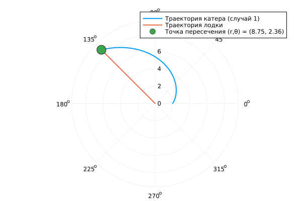

---
## Front matter
title: "Лабораторная работа №2"
subtitle: "Задача о погоне"
author: "Хрусталев Влад Николаевич"

## Generic otions
lang: ru-RU
toc-title: "Содержание"

## Bibliography
bibliography: bib/cite.bib
csl: pandoc/csl/gost-r-7-0-5-2008-numeric.csl

## Pdf output format
toc: true # Table of contents
toc-depth: 2
lof: true # List of figures
lot: true # List of tables
fontsize: 12pt
linestretch: 1.5
papersize: a4
documentclass: scrreprt
## I18n polyglossia
polyglossia-lang:
  name: russian
  options:
	- spelling=modern
	- babelshorthands=true
polyglossia-otherlangs:
  name: english
## I18n babel
babel-lang: russian
babel-otherlangs: english
## Fonts
mainfont: IBM Plex Serif
romanfont: IBM Plex Serif
sansfont: IBM Plex Sans
monofont: IBM Plex Mono
mathfont: STIX Two Math
mainfontoptions: Ligatures=Common,Ligatures=TeX,Scale=0.94
romanfontoptions: Ligatures=Common,Ligatures=TeX,Scale=0.94
sansfontoptions: Ligatures=Common,Ligatures=TeX,Scale=MatchLowercase,Scale=0.94
monofontoptions: Scale=MatchLowercase,Scale=0.94,FakeStretch=0.9
mathfontoptions:
## Biblatex
biblatex: true
biblio-style: "gost-numeric"
biblatexoptions:
  - parentracker=true
  - backend=biber
  - hyperref=auto
  - language=auto
  - autolang=other*
  - citestyle=gost-numeric
## Pandoc-crossref LaTeX customization
figureTitle: "Рис."
tableTitle: "Таблица"
listingTitle: "Листинг"
lofTitle: "Список иллюстраций"
lotTitle: "Список таблиц"
lolTitle: "Листинги"
## Misc options
indent: true
header-includes:
  - \usepackage{indentfirst}
  - \usepackage{float} # keep figures where there are in the text
  - \floatplacement{figure}{H} # keep figures where there are in the text
---

# Цель работы

Построить математическую модель для выбора правильной стратегии при решении примера задаче о погоне.

# Задание

На море в тумане катер береговой охраны преследует лодку браконьеров. Через определенный промежуток времени туман рассеивается, и лодка обнаруживается на расстоянии 5,9 км от катера. Затем лодка снова скрывается в тумане и уходит прямолинейно в неизвестном направлении. Известно, что скорость катера в 1,9 раза больше скорости браконьерской лодки.

1. Записать уравнение, описывающее движение катера, с начальными условиями для двух случаев (в зависимости от расположения катера относительно лодки в начальный момент времени).

2. Построить траекторию движения катера и лодки для двух случаев.

3. Найти точку пересечения траектории катера и лодки 

# Теоретическое введение

Кривая погони — кривая, представляющая собой решение задачи о «погоне», которая ставится следующим образом. Пусть точка A равномерно движется по некоторой заданной кривой. Требуется найти траекторию равномерного движения точки P такую, что касательная, проведённая к траектории в любой момент движения, проходила бы через соответствующее этому моменту положение точки A [@wiki:bash].

# Выполнение лабораторной работы

Мой вариант - это (1132222011 % 70) + 1 = 12

Запишем уравнение описывающее движение катера, с начальными условиями для двух случаев (в зависимости от расположения катера относительно лодки в начальный момент времени).

Принимем за $t_0 = 0$, $x_0 = 0$ -- место нахождения лодки браконьеров в момент обнаружения,$x_{k0} = k$ - место нахождения катера береговой охраны относительно лодки браконьеров в момент обнаружения лодки.

Введем полярные координаты. Считаем, что полюс - это точка обнаружения лодки браконьеров $x_{k0}$ ($\theta = x_{k0} = 0$), а полярная ось $r$ проходит через точку нахождения катера береговой охраны.

Траектория катера должна быть такой, чтобы и катер, и лодка все время были на одном расстоянии от полюса $\theta$ , только в этом случае траектория
катера пересечется с траекторией лодки. Поэтому для начала катер береговой охраны должен двигаться некоторое время прямолинейно, пока не окажется на том же расстоянии от полюса, что и лодка браконьеров. После этого катер береговой охраны должен двигаться вокруг полюса удаляясь от него с той же скоростью, что и лодка браконьеров.

Чтобы найти расстояние $x$ (расстояние после которого катер начнет двигаться вокруг полюса), необходимо составить простое уравнение. Пусть через время $t$ катер и лодка окажутся на одном расстоянииx от полюса. За это время лодка пройдет $x$ , а катер $k-x$ (или $k+x$, в зависимости от начального положения катера относительно полюса). Время, за которое они пройдут это расстояние, вычисляется как $\dfrac{x}{v}$ или $\dfrac{k-x}{1.9v}$ (во втором случае $\dfrac{k+x}{1.9v}$). Так как время одно и то же, то эти величины одинаковы. Тогда неизвестное расстояниеx можно найти из следующего уравнения:

$$
\dfrac{x}{v} = \dfrac{k-x}{1.9v} \text{ -- в первом случае}
$$
$$
\dfrac{x}{v} = \dfrac{k+x}{1.9v} \text{ -- во втором}
$$

Отсюда мы найдем два значения $x_1 = \dfrac{5.9}{2.9}$ и $x_2 = \dfrac{5.9}{0,9}$, задачу будем решать для двух случаев.

После того, как катер береговой охраны окажется на одном расстоянии от полюса, что и лодка, он должен сменить прямолинейную траекторию и начать двигаться вокруг полюса удаляясь от него со скоростью лодки $v$. Для этого скорость катера раскладываем на две составляющие: $v_{r}$ - радиальная скорость и  - $v_{\tau}$ тангенциальная скорость. Радиальная скорость - это скорость, с которой катер удаляется от полюса, $v_r = \dfrac{dr}{dt}$. Нам нужно, чтобы эта скорость была равна скорости лодки, поэтому полагаем $\dfrac{dr}{dt} = v$.

Тангенциальная скорость – это линейная скорость вращения катера относительно полюса. Она равна произведению угловой скорости $\dfrac{d \theta}{dt}$ на радиус $r$, $r \dfrac{d \theta}{dt}$.

Получаем:

$$v_{\tau} = \sqrt{3.61v^2-v^2} = \sqrt{2.61}v$$

Отсюда выводим:

$$
r\dfrac{d \theta}{dt} = \sqrt{2.61}v
$$

Решение исходной задачи сводится к решению системы из двух дифференциальных уравнений:

$$\begin{cases}
&\dfrac{dr}{dt} = v\\
&r\dfrac{d \theta}{dt} = \sqrt{2.61}v
\end{cases}$$

С начальными условиями для первого случая:

$$\begin{cases}
&{\theta}_0 = 0\\  \tag{1}
&r_0 = \dfrac{5.9}{2.9}
\end{cases}$$

Или для второго:

$$\begin{cases}
&{\theta}_0 = -\pi\\  \tag{2}
&r_0 = \dfrac{5.9}{0.9}
\end{cases}$$

Исключая из полученной системы производную по $t$, можно перейти к следующему уравнению:

$$
\dfrac{dr}{d \theta} = \dfrac{r}{\sqrt{2.61}}
$$

Начальные условия остаются прежними. Решив это уравнение, мы получим траекторию движения катера в полярных координатах.

## Построение модели / Программы

```Julia
using DifferentialEquations, Plots, Printf

# Параметры задачи
k = 5.9            # расстояние от лодки до катера при обнаружении (км)
n = 1.9            # отношение скоростей: скорость катера = n * скорость лодки
α = sqrt(n^2 - 1)  # α = sqrt(2.61) ≈ 1.616
fi = 3*pi/4        # направление движения лодки (радианы)
v = 1.0            # скорость лодки (единица, для построения графика)

# Определяем ОДУ для фазового уравнения движения катера:
# Решаем уравнение: dr/dθ = r / α
# Здесь u = r, независимая переменная обозначена как θ.
f(u, p, t) = u / α  # функция с тремя аргументами

########################################################################
# СЛУЧАЙ 1
########################################################################

# Начальные условия: катер начинает поворот с r = k/2.9 при θ = 0
r0_case1 = k / 2.9
θspan1 = (0.0, fi)

prob1 = ODEProblem(f, r0_case1, θspan1)
sol1 = solve(prob1, saveat=0.01)

# В точке θ = fi получаем радиус пересечения
r_int1 = sol1.u[end]

# Траектория лодки: движется вдоль постоянного угла fi, радиус равен r = t (при v=1)
t_vals = 0:0.01:r_int1
θ_boat = fill(fi, length(t_vals))
r_boat = t_vals

# Формируем строку с рассчитанными значениями точки пересечения
intersection_label1 = @sprintf("Точка пересечения (r,θ) = (%.2f, %.2f)", r_int1, fi)

# Построение графика (случай 1)
plt1 = plot(sol1.t, sol1.u, proj=:polar, lw=2,
    label="Траектория катера (случай 1)")
plot!(θ_boat, r_boat, proj=:polar, lw=2,
    label="Траектория лодки")
scatter!([fi], [r_int1], marker=(:circle, 10),
    label=intersection_label1)
savefig(plt1, "lab2_01.png")


########################################################################
# СЛУЧАЙ 2
########################################################################

# Начальные условия: катер начинает поворот с r = k/0.9 при θ = -π
r0_case2 = k / 0.9
θspan2 = (-pi, fi)

prob2 = ODEProblem(f, r0_case2, θspan2)
sol2 = solve(prob2, saveat=0.01)

r_int2 = sol2.u[end]

# Траектория лодки: движение вдоль угла fi, r = t (при v=1)
t_vals2 = 0:0.01:r_int2
θ_boat2 = fill(fi, length(t_vals2))
r_boat2 = t_vals2

# Формируем строку с рассчитанными значениями точки пересечения
intersection_label2 = @sprintf("Точка пересечения (r,θ) = (%.2f, %.2f)", r_int2, fi)

# Построение графика (случай 2)
plt2 = plot(sol2.t, sol2.u, proj=:polar, lw=2,
    label="Траектория катера (случай 2)")
plot!(θ_boat2, r_boat2, proj=:polar, lw=2,
    label="Траектория лодки")
scatter!([fi], [r_int2], marker=(:circle, 10),
    label=intersection_label2)
savefig(plt2, "lab2_02.png")

```

В результате получаем график для первого варианта(рис. [-@fig:001]) и для второго(рис. [-@fig:002]).

{#fig:001 width=100%}

{#fig:002 width=100%}

Из графикиков можно получить ответы: 

Для варианта 1:

```
Точка пересечения (r,θ) = (8.75, 2.36)
``` 

для вариант 2:

```
Точка пересечения (r,θ) = (197.03, 2.36)
``` 

# Выводы

В процессе выполнения данной лабораторной работы я построила математическую модель для выбора правильной стратегии при решении примера задаче о погоне.

# Список литературы{.unnumbered}

::: {#refs}
:::
