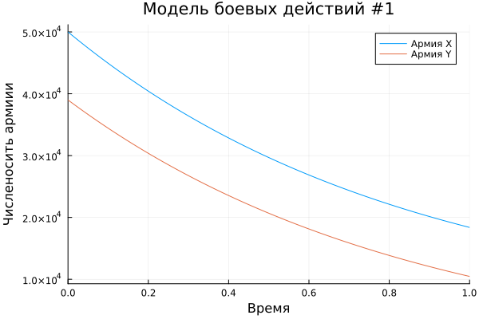
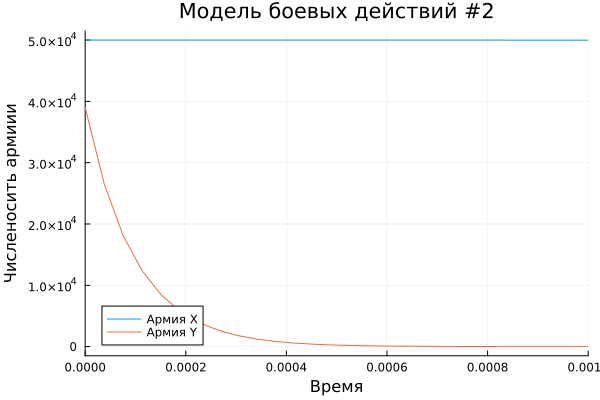

---
## Front matter
lang: ru-RU
title: Лабораторная работа №3
subtitle: Модель боевых действий
author:
  - Хрусталев В.Н.
institute:
  - Российский университет дружбы народов, Москва, Россия

## i18n babel
babel-lang: russian
babel-otherlangs: english

## Formatting pdf
toc: false
toc-title: Содержание
slide_level: 2
aspectratio: 169
section-titles: true
theme: metropolis
header-includes:
 - \metroset{progressbar=frametitle,sectionpage=progressbar,numbering=fraction}
---

# Информация

## Цель работы

Построить модель боевых действий на языке програмирования Jilia

## Задание

Между страной $X$ и страной $Y$ идет война. Численность состава войск
исчисляется от начала войны, и являются временными функциями $x(t)$ и $y(t)$. В
начальный момент времени страна $X$ имеет армию численностью 50 000 человек,
а в распоряжении страны $Y$ армия численностью в 39 000 человек. Для упрощения
модели считаем, что коэффициенты $a, b, c, h$ постоянны. Также считаем $P(t)$ и $Q(t)$ непрерывные функции.

Построить графики изменения численности войск армии $X$ и армии $Y$ для  следующих случаев:

## Задание

1. Модель боевых действий между регулярными войсками

$$\begin{cases}
    \dfrac{dx}{dt} = -0,445x(t)-0,806y(t)+sin(t+7)+1\\
    \dfrac{dy}{dt} = -0,419x(t)-0,703y(t)+cos(t+4)+1
\end{cases}$$

## Задание


2. Модель ведение боевых действий с участием регулярных войск и партизанских отрядов

$$\begin{cases}
    \dfrac{dx}{dt} = -0,203x(t)-0,705y(t)+sin(2t)\\
    \dfrac{dy}{dt} = -0,203x(t)y(t)-0,801y(t)+2cos(t)
\end{cases}$$

## Выполнение лабораторной работы

Мой вариант - это (1132222011 % 70) + 1 = 12

## Модель боевых действий между регулярными войсками

$$\begin{cases}
    \dfrac{dx}{dt} = -0,445x(t)-0,806y(t)+sin(t+7)+1\\
    \dfrac{dy}{dt} = -0,419x(t)-0,703y(t)+cos(t+4)+1
\end{cases}$$

## Модель боевых действий между регулярными войсками

```Julia

using DifferentialEquations, Plots;

#диф уравнение модели боевых действий между рег войсками
function reg_part(u, p, t)
    x, y = u
    a, b, c, h = p
    dx = -a*x - b*y + sin(t+7) + 1
    dy = -c*x - h*y + cos(t+4) + 1
    return [dx, dy]
end

```

## Модель боевых действий между регулярными войсками

```Julia

#нач условия
u0 = [50000, 39000]
p = [0.445, 0.806, 0.419, 0.703]
tspan = (0,1)

```

## Модель боевых действий между регулярными войсками

```Julia

prob1 = ODEProblem(reg_part, u0, tspan, p)

sol1 = solve(prob1, Tsit5())

plt1 = plot(sol1, title = "Модель боевых действий #1", label = ["Армия X" "Армия Y"], xaxis = "Время", yaxis = "Численосить армиии")

savefig(plt1, "lab3_01.png")

```


## Модель боевых действий между регулярными войсками

{#fig:001 width=70%}


## Модель боевых действий c участием регулярных войск и партизанских отрядов

$$\begin{cases}
    \dfrac{dx}{dt} = -0,203x(t)-0,705y(t)+sin(2t)\\
    \dfrac{dy}{dt} = -0,203x(t)y(t)-0,801y(t)+2cos(t)
\end{cases}$$

## Модель боевых действий c участием регулярных войск и партизанских отрядов

```Julia

using DifferentialEquations, Plots;

#диф уравнение модели боевых действий между рег войсками
function reg_part(u, p, t)
    x, y = u
    a, b, c, h = p
    dx = -a*x - b*y + sin(2*t)
    dy = -c*x*y- h*y + 2*cos(t)
    return [dx, dy]
end

```

## Модель боевых действий c участием регулярных войск и партизанских отрядов

```Julia
#нач условия
u0 = [50000, 39000]
p = [0.203, 0.705, 0.203, 0.801]
tspan = (0,1)

```

## Модель боевых действий c участием регулярных войск и партизанских отрядов

```Julia
prob2 = ODEProblem(reg_part, u0, tspan, p)

sol2 = solve(prob2, Tsit5())

plt2 = plot(sol2, title = "Модель боевых действий #2", label = ["Армия X" "Армия Y"], xaxis = "Время", yaxis = "Численосить армиии", xlimit = [0,0.001])

savefig(plt2, "lab3_02.png")

```

## Модель боевых действий c участием регулярных войск и партизанских отрядов

{#fig:002 width=70%}

## Вывод

В ходе выполнения лабораторной работы я построил модель боевых действий на языке програмитрования Julia, а так же проанализировал полученные результаты.

## Список литературы

1. Законы Осипова — Ланчестера [Электронный ресурс]. URL: https://ru.wikipedia.org/wiki/Законы_Осипова_—_Ланчестера.

2. Документация по Julia [Электронный ресурс].  URL: https://docs.julialang.org/en/v1/
