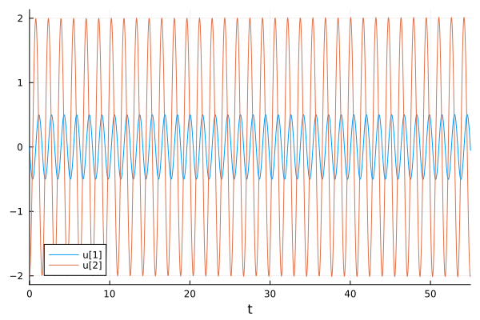
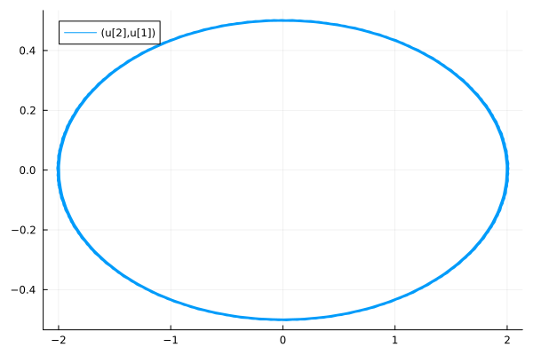
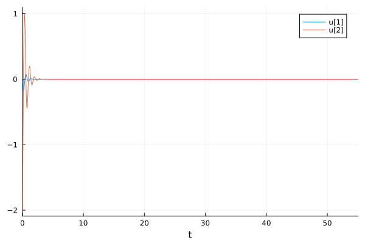
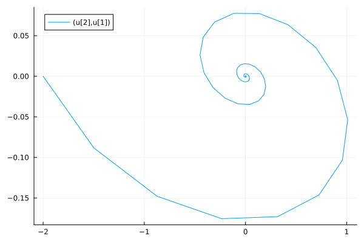
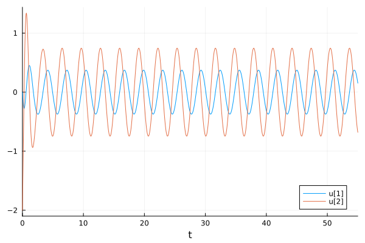
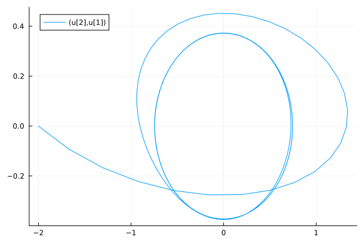

---
## Front matter
lang: ru-RU
title: Лабораторная работа №4
subtitle: Модель гармонических колебаний
author:
  - Хрусталев В.Н.
institute:
  - Российский университет дружбы народов, Москва, Россия

## i18n babel
babel-lang: russian
babel-otherlangs: english

## Formatting pdf
toc: false
toc-title: Содержание
slide_level: 2
aspectratio: 169
section-titles: true
theme: metropolis
header-includes:
 - \metroset{progressbar=frametitle,sectionpage=progressbar,numbering=fraction}
---

# Информация

## Цель работы

Построить модель гармонического осцилятора.

## Задание

**Вариант [(1132222011 % 70) + 1] = 12**

Построить фазовый портрет гармонического осциллятора и решение уравнения гармонического осциллятора для следующих случаев:

## Задание

1. Колебания гармонического осциллятора без затуханий и без действий внешней силы

$$\ddot{x} +4x = 0,$$ 

## Задание

2. Колебания гармонического осциллятора c затуханием и без действий внешней силы

$$\ddot{x} + 4 \dot x + 8x = 0,$$ 


## Задание 

3. Колебания гармонического осциллятора c затуханием и под действием внешней силы

$$\ddot{x} + 3 \dot x + 4x = 5 sin(2t),$$ 

На интервале $t \in [0; 55]$ (шаг 0.05) с начальными условиями $x_0 = 0, \,\, y_0 = -2.$

## Модель колебаний гармонического осциллятора без затуханий и без действия внешней силы

```Julia
using DifferentialEquations, Plots; gr()

tspan = (0,55)
u0 = [0, -2]
p1 = [0, 4]
step = 0.05

function f1(u, p, t)
    x, y = u
    g, w = p
    dx = y
    dy = -g .*y - w^2 .*x
    return [dx, dy]
end
```

## Модель колебаний гармонического осциллятора без затуханий и без действия внешней силы

```Julia
problem1 = ODEProblem(f1, u0, tspan, p1)
sol1 = solve(problem1, Tsit5(), saveat = step)

plot(sol1)
savefig("lab4_1_sol.png")

plot(sol1, vars=(2,1))
savefig("lab4_1_ph.png")
```

## Модель колебаний гармонического осциллятора без затуханий и без действия внешней силы

{#fig:001, width=70%}

## Модель колебаний гармонического осциллятора без затуханий и без действия внешней силы

{#fig:002, width=70%}


## Модель колебаний гармонического осциллятора с затуханием и без действия внешней силы

```Julia
using DifferentialEquations, Plots; gr()

tspan = (0,55)
u0 = [0, -2]
p1 = [4, 8]
step = 0.05

function f1(u, p, t)
    x, y = u
    g, w = p
    dx = y
    dy = -g .*y - w^2 .*x
    return [dx, dy]
end
```

## Модель колебаний гармонического осциллятора с затуханием и без действия внешней силы

```Julia
problem2 = ODEProblem(f1, u0, tspan, p1)
sol2 = solve(problem2, Tsit5(), saveat = step)

plot(sol2)
savefig("lab4_2_sol.png")

plot(sol2, vars=(2,1))
savefig("lab4_2_ph.png")
```

## Модель колебаний гармонического осциллятора с затуханием и без действия внешней силы

{#fig:003, width=70%}

## Модель колебаний гармонического осциллятора с затуханием и без действия внешней силы

{#fig:004, width=70%}

## Модель колебаний гармонического осциллятора с затуханием и под действия внешней силы

```Julia
using DifferentialEquations, Plots; gr()

tspan = (0,55)
u0 = [0, -2]
p1 = [3, 4]
step = 0.05

f(t) = 5*sin(2*t)

function f1(u, p, t)
    x, y = u
    g, w = p
    dx = y
    dy = -g .*y - w^2 .*x .+f(t)
    return [dx, dy]
end
```

## Модель колебаний гармонического осциллятора с затуханием и под действия внешней силы

```Julia
problem3 = ODEProblem(f1, u0, tspan, p1)
sol3 = solve(problem3, Tsit5(), saveat = step)

plot(sol3)
savefig("lab4_3_sol.png")

plot(sol3, vars=(2,1))
savefig("lab4_3_ph.png")
```

## Модель колебаний гармонического осциллятора с затуханием и под действия внешней силы

{#fig:005, width=70%}

## Модель колебаний гармонического осциллятора с затуханием и под действия внешней силы

{#fig:006, width=70%}

## Вывод

В ходе выполнения лабораторной работы я построил модель боевых действий на языке програмитрования Julia, а так же проанализировал полученные результаты.

## Список литературы

1. Гармонические колебания [Электронный ресурс]. URL: https://ru.wikipedia.org/wiki/Гармонические_колебания.
