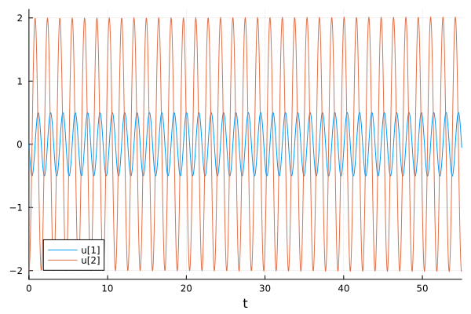
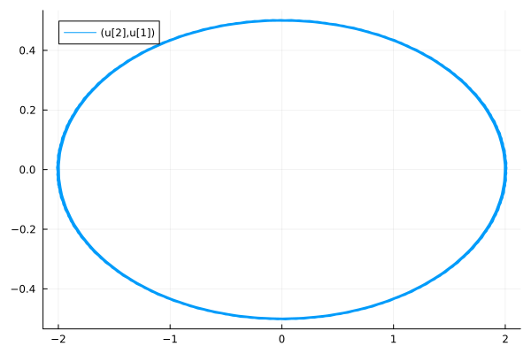
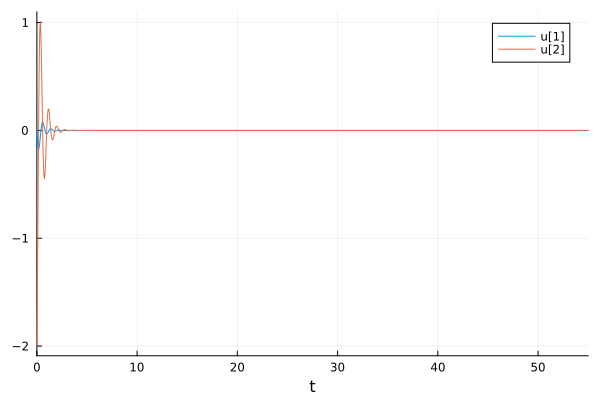
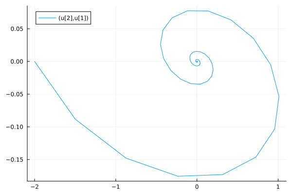
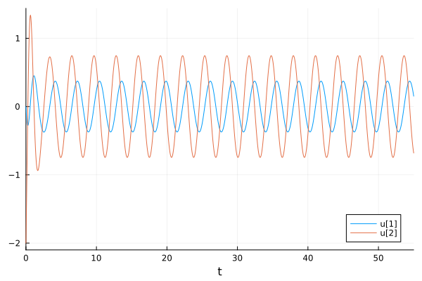
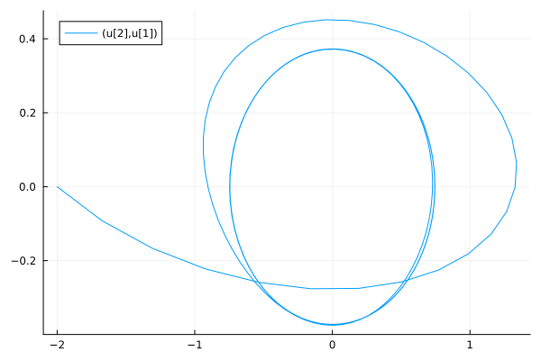

---
## Front matter
title: "Лабораторная работа №4"
subtitle: "Модель гармонических колебаний"
author: "Хрусталев Влад Николаевич"

## Generic otions
lang: ru-RU
toc-title: "Содержание"

## Bibliography
bibliography: bib/cite.bib
csl: pandoc/csl/gost-r-7-0-5-2008-numeric.csl

## Pdf output format
toc: true # Table of contents
toc-depth: 2
lof: true # List of figures
lot: true # List of tables
fontsize: 12pt
linestretch: 1.5
papersize: a4
documentclass: scrreprt
## I18n polyglossia
polyglossia-lang:
  name: russian
  options:
	- spelling=modern
	- babelshorthands=true
polyglossia-otherlangs:
  name: english
## I18n babel
babel-lang: russian
babel-otherlangs: english
## Fonts
mainfont: IBM Plex Serif
romanfont: IBM Plex Serif
sansfont: IBM Plex Sans
monofont: IBM Plex Mono
mathfont: STIX Two Math
mainfontoptions: Ligatures=Common,Ligatures=TeX,Scale=0.94
romanfontoptions: Ligatures=Common,Ligatures=TeX,Scale=0.94
sansfontoptions: Ligatures=Common,Ligatures=TeX,Scale=MatchLowercase,Scale=0.94
monofontoptions: Scale=MatchLowercase,Scale=0.94,FakeStretch=0.9
mathfontoptions:
## Biblatex
biblatex: true
biblio-style: "gost-numeric"
biblatexoptions:
  - parentracker=true
  - backend=biber
  - hyperref=auto
  - language=auto
  - autolang=other*
  - citestyle=gost-numeric
## Pandoc-crossref LaTeX customization
figureTitle: "Рис."
tableTitle: "Таблица"
listingTitle: "Листинг"
lofTitle: "Список иллюстраций"
lotTitle: "Список таблиц"
lolTitle: "Листинги"
## Misc options
indent: true
header-includes:
  - \usepackage{indentfirst}
  - \usepackage{float} # keep figures where there are in the text
  - \floatplacement{figure}{H} # keep figures where there are in the text
---

# Цель работы

Построить модель гармонического осцилятора.

# Задание

**Вариант 12**

Построить фазовый портрет гармонического осциллятора и решение уравнения гармонического осциллятора для следующих случаев:

1. Колебания гармонического осциллятора без затуханий и без действий внешней силы

$$\ddot{x} +4x = 0,$$ 

2. Колебания гармонического осциллятора c затуханием и без действий внешней силы

$$\ddot{x} + 4 \dot x + 8x = 0,$$ 

3. Колебания гармонического осциллятора c затуханием и под действием внешней силы

$$\ddot{x} + 3 \dot x + 4x = 5 sin(2t),$$ 

На интервале $t \in [0; 55]$ (шаг 0.05) с начальными условиями $x_0 = 0, \,\, y_0 = -2.$

# Теоретическое введение

Гармонические колебания — колебания, при которых физическая величина изменяется с течением времени по гармоническому (синусоидальному, косинусоидальному) закону.

Уравнение гармонического колебания имеет вид

$$x(t)=A\sin(\omega t+\varphi _{0})$$

или

$$x(t)=A\cos(\omega t+\varphi _{0}),$$ 

где $x$ — отклонение колеблющейся величины в текущий момент времени $t$ от среднего за период значения (например, в кинематике — смещение, отклонение колеблющейся точки от положения равновесия);
$A$ — амплитуда колебания, то есть максимальное за период отклонение колеблющейся величины от среднего за период значения, размерность 
$A$ совпадает с размерностью $x$;
$\omega$ (радиан/с, градус/с) — циклическая частота, показывающая, на сколько радиан (градусов) изменяется фаза колебания за 1 с;

$(\omega t+\varphi _{0})=\varphi$ (радиан, градус) — полная фаза колебания (сокращённо — фаза, не путать с начальной фазой);

$\varphi _{0}$ (радиан, градус) — начальная фаза колебаний, которая определяет значение полной фазы колебания (и самой величины $x$) в момент времени $t=0$.
Дифференциальное уравнение, описывающее гармонические колебания, имеет вид

$$\frac {d^{2}x}{dt^{2}}+\omega ^{2}x=0.$$

[@wiki_bash].


# Выполнение лабораторной работы

Мой вариант - это (1132222011 % 70) + 1 = 12

## Модель колебаний гармонического осциллятора без затуханий и без действия внешней силы

Для начала реализуем данную модель на языке Julia.

```Julia
using DifferentialEquations, Plots; gr()

tspan = (0,55)
u0 = [0, -2]
p1 = [0, 4]
step = 0.05

function f1(u, p, t)
    x, y = u
    g, w = p
    dx = y
    dy = -g .*y - w^2 .*x
    return [dx, dy]
end

problem1 = ODEProblem(f1, u0, tspan, p1)
sol1 = solve(problem1, Tsit5(), saveat = step)

plot(sol1)
savefig("lab4_1_sol.png")

plot(sol1, vars=(2,1))
savefig("lab4_1_ph.png")
```

В результате выполнения программы мы получаем следующие графики решения уравнения гармонического осциллятора (рис. [-@fig:001]) и его фазового портрета (рис. [-@fig:002]).

{#fig:001, width=70%}

{#fig:002, width=70%}

Как мы видим, колебания осциллятора переодичное и график не затухает.

## Модель колебаний гармонического осциллятора с затуханием и без действия внешней силы

Реализуем данную модель на языке Julia.

```Julia
using DifferentialEquations, Plots; gr()

tspan = (0,55)
u0 = [0, -2]
p1 = [4, 8]
step = 0.05

function f1(u, p, t)
    x, y = u
    g, w = p
    dx = y
    dy = -g .*y - w^2 .*x
    return [dx, dy]
end

problem2 = ODEProblem(f1, u0, tspan, p1)
sol2 = solve(problem2, Tsit5(), saveat = step)

plot(sol2)
savefig("lab4_2_sol.png")

plot(sol2, vars=(2,1))
savefig("lab4_2_ph.png")
```

В результате выполнения программы мы получаем следующие графики решения уравнения гармонического осциллятора (рис. [-@fig:003]) и его фазового портрета (рис. [-@fig:004]).

{#fig:003, width=70%}

{#fig:004, width=70%}

В этом случае видно как происходят колебания осциллятора, а затем график затухает, так как есть параметр, который отвечает за потери энергии.

## Модель колебаний гармонического осциллятора с затуханием и под действия внешней силы

Реализуем данную модель на языке Julia.

```Julia
using DifferentialEquations, Plots; gr()

tspan = (0,55)
u0 = [0, -2]
p1 = [3, 4]
step = 0.05

f(t) = 5*sin(2*t)

function f1(u, p, t)
    x, y = u
    g, w = p
    dx = y
    dy = -g .*y - w^2 .*x .+f(t)
    return [dx, dy]
end

problem3 = ODEProblem(f1, u0, tspan, p1)
sol3 = solve(problem3, Tsit5(), saveat = step)

plot(sol3)
savefig("lab4_3_sol.png")

plot(sol3, vars=(2,1))
savefig("lab4_3_ph.png")
```

В результате выполнения программы мы получаем следующие графики решения уравнения гармонического осциллятора (рис. [-@fig:005]) и его фазового портрета (рис. [-@fig:006]).

{#fig:005, width=70%}

{#fig:006, width=70%}

# Ответы на вопросы к лабораторной работе

## 1. Запишите простейшую модель гармонических колебаний

Простейшая модель гармонических колебаний — это уравнение свободных колебаний гармонического осциллятора без затухания:

$$
\ddot{x} + \omega_0^2 x = 0
$$

где:
- $x$ — переменная, описывающая состояние системы (например, смещение грузика или заряд конденсатора),
- $\omega_0$ — собственная частота колебаний,
- $\ddot{x}$ — вторая производная $x$ по времени, т.е. ускорение.

Это линейное однородное дифференциальное уравнение второго порядка описывает консервативную систему, в которой энергия сохраняется.

## 2. Дайте определение осциллятора

**Осциллятор** — это система, способная совершать колебания.  
Линейный гармонический осциллятор — это модель, описывающая колебательные процессы, например, в механике (грузик на пружине), электротехнике (заряд в колебательном контуре), биологии и других областях. Он описывается линейным дифференциальным уравнением второго порядка. При отсутствии потерь система является консервативной, и ее энергия остается постоянной во времени.

## 3. Запишите модель математического маятника

Математический маятник описывается следующим уравнением:

$$
\ddot{\theta} + \frac{g}{l}\sin\theta = 0
$$

где:
- $\theta$ — угол отклонения от положения равновесия,
- $g$ — ускорение свободного падения,
- $l$ — длина маятника.

При малых колебаниях можно использовать приближение $\sin\theta \approx \theta$, тогда уравнение принимает вид:

$$
\ddot{\theta} + \frac{g}{l} \theta = 0
$$

что совпадает по форме с уравнением гармонического осциллятора.

## 4. Запишите алгоритм перехода от дифференциального уравнения второго порядка к двум дифференциальным уравнениям первого порядка

Алгоритм:

1. Вводим обозначение: $y = \dot{x}$ (первая производная $x$ по времени).
2. Исходное уравнение $\ddot{x} + \omega_0^2 x = 0$ преобразуется в систему:

   $$
   \begin{cases}
   \dot{x} = y \\
   \dot{y} = -\omega_0^2 x
   \end{cases}
   $$

3. Начальные условия:  
   $x(0) = x_0$,  
   $y(0) = y_0$

Таким образом, получаем систему двух уравнений первого порядка, которая описывает ту же динамику, что и исходное уравнение второго порядка.

## 5. Что такое фазовый портрет и фазовая траектория?

**Фазовая траектория** — это кривая в фазовой плоскости, задающая изменение состояния системы во времени. Каждая точка этой кривой соответствует определённому значению координаты $x$ и скорости $y = \dot{x}$ в момент времени $t$.

**Фазовый портрет** — это совокупность фазовых траекторий, построенных для различных начальных условий. Он позволяет визуально оценить поведение системы в фазовом пространстве и понять её динамику при различных параметрах и условиях.

# Выводы

В ходе выполнения лабораторной работы я построил модель гармонического осцилятора на языке Julia.

# Список литературы{.unnumbered}

::: {#refs}
:::
