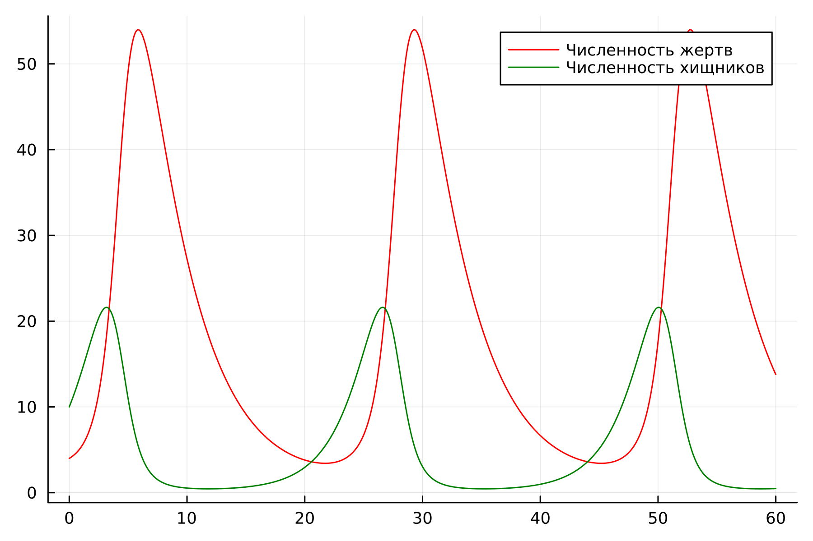
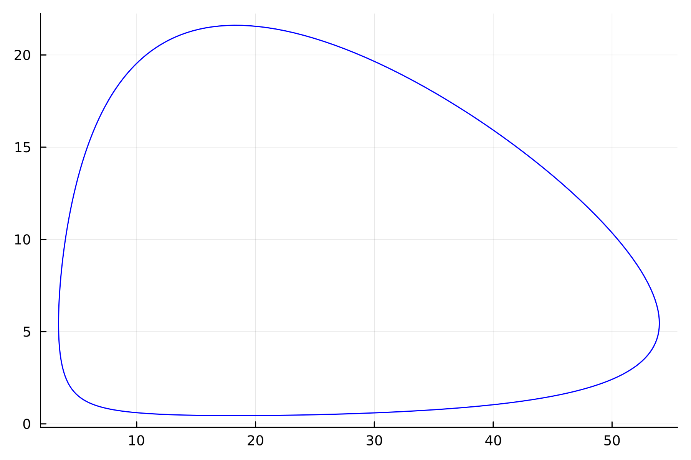
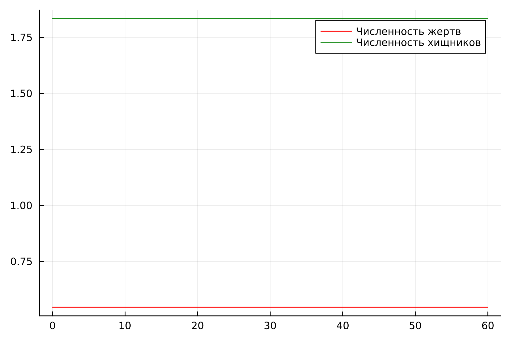

---
## Front matter
lang: ru-RU
title: Лабораторная работа №5
subtitle: Модель Лотки-Вольтерры
author:
  - Хрусталев В.Н.
institute:
  - Российский университет дружбы народов, Москва, Россия

## i18n babel
babel-lang: russian
babel-otherlangs: english

## Formatting pdf
toc: false
toc-title: Содержание
slide_level: 2
aspectratio: 169
section-titles: true
theme: metropolis
header-includes:
 - \metroset{progressbar=frametitle,sectionpage=progressbar,numbering=fraction}
---

# Информация

## Цель работы

Исследовать математическую модель Лотки-Вольерры.

## Задание

**Вариант [(1132222011 % 70) + 1] = 12**

## Задание

Для модели «хищник-жертва»:

$$\begin{cases}
    &\dfrac{dx}{dt} = -0.24 x(t) + 0.044 x(t) y(t)
    &\dfrac{dy}{dt} = 0.44 x(t) - 0.024 x(t) y(t)
\end{cases}$$

## Задание

Построить график зависимости численности хищников от численности жертв,
а также графики изменения численности хищников и численности жертв при
следующих начальных условиях:
$x_0 = 4, $y_0 = 10
Найти стационарное состояние системы.

## Программа 1

```Julia
using Plots
using DifferentialEquations

function ode_fn(du, u, p, t)
    x, y = u
    dx = -0.24*u[1] + 0.044 * x * y
    dy = 0.44 * u[2] - 0.024 * x * y
    du = [dx, dy]
end

v0 = [4, 10]
tspan = (0.0, 60.0)
prob = ODEProblem(ode_fn, v0, tspan)
sol = solve(prob, dtmax=0.05)
X = [u[1] for u in sol.u]
Y = [u[2] for u in sol.u]
T = [t for t in sol.t]
```

## Программа 1

```Julia
plt = plot(dpi=300,legend=false)

plot!(plt, X, Y, color=:blue)

savefig(plt, "lab05_1.png")

plt2 = plot( dpi=300, legend=true)

plot!(plt2, T, X, label="Численность жертв", color=:red)

plot!(plt2, T, Y, label="Численность хищников", color=:green)

savefig(plt2, "lab05_2.png")
```

## График изменения численности хищников и численности жертв

{#fig:001 width=70%}


## График зависимости численности хищников от численноости жертв

{#fig:002 width=70%}

## Стационарное состояние системы

$$\begin{cases}
  &x_0 = \dfrac{\gamma}{\delta}\\
  &y_0 = \dfrac{\alpha}{\beta}
\end{cases}
$$

и получим что 

$$\begin{cases}
  &x_0 = \dfrac{0.24}{0.44} ≈ 0.54545454545\\
  &y_0 = \dfrac{0.044}{0.024} ≈ 1.83333333333
\end{cases}
$$.


## Программа 2

```Julia
using Plots
using DifferentialEquations

function ode_fn(du, u, p, t)
    x, y = u
    dx = -0.24*u[1] + 0.044 * x * y
    dy = 0.44 * u[2] - 0.024 * x * y
    du = [dx, dy]
end

v0 = [0.24/0.44, 0.044/0.024]
tspan = (0.0, 60.0)
prob = ODEProblem(ode_fn, v0, tspan)
sol = solve(prob, dtmax=0.05)
X = [u[1] for u in sol.u]
Y = [u[2] for u in sol.u]
T = [t for t in sol.t]
```

## Программа 2

```Julia
plt2 = plot( dpi=300, legend=true)

plot!(plt2, T, X, label="Численность жертв", color=:red)

plot!(plt2, T, Y, label="Численность хищников", color=:green)

savefig(plt2, "lab05_3.png")
```

## График изменения численности хищников и численности жертв в стационарном состояниии

{#fig:003 width=70%}

## Вывод

В ходе выполнения лабораторной работы я построил модель Лотки-Вольтерры на Julia

## Список литературы

1. Модель Лотки — Вольтерры [Электронный ресурс]. URL: https://ru.wikipedia.org/wiki/Модель_Лотки_—_Вольтерры
