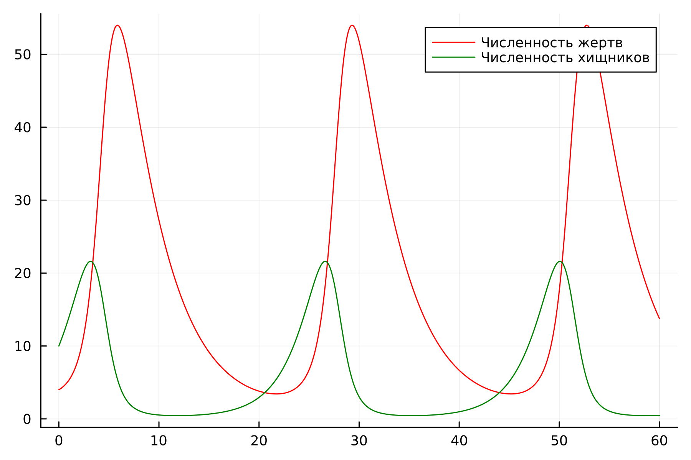
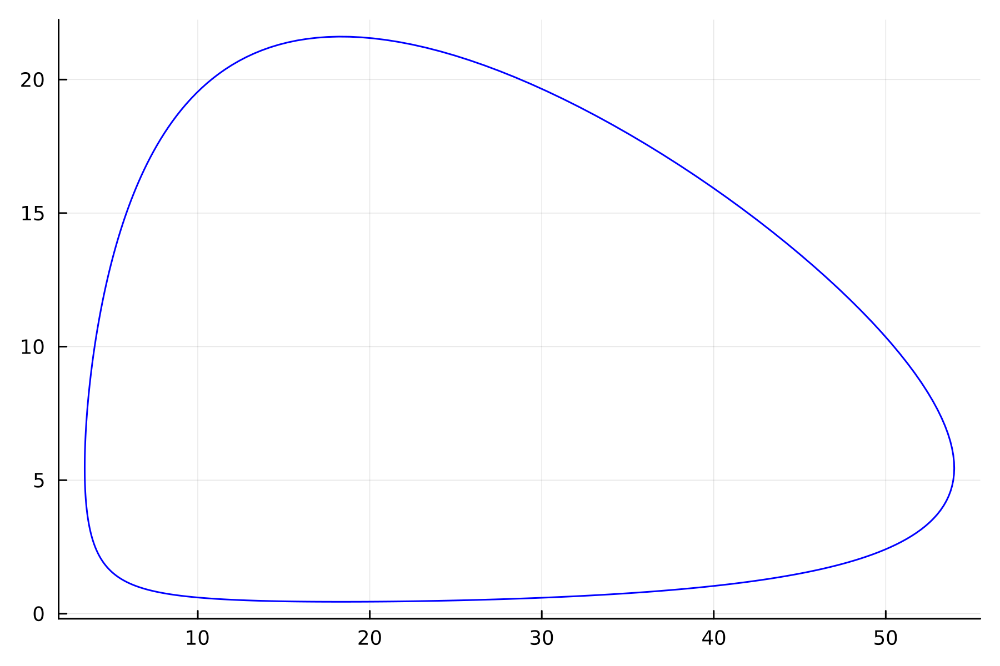
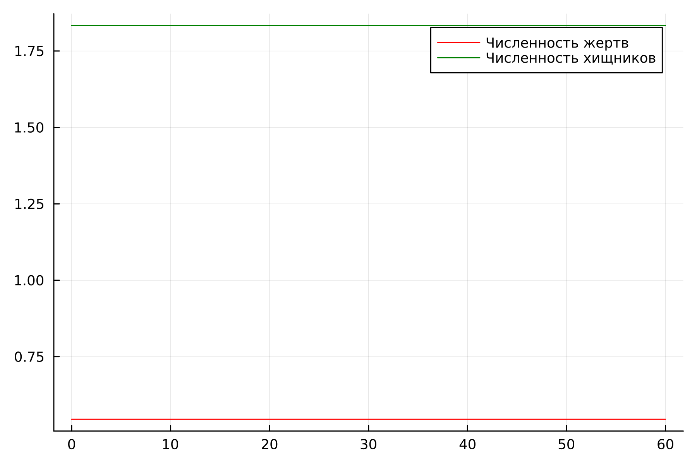

---
## Front matter
title: "Лабораторная работа №5"
subtitle: "Модель Лотки-Вольтерры"
author: "Хрусталев Влад Николаевич"

## Generic otions
lang: ru-RU
toc-title: "Содержание"

## Bibliography
bibliography: bib/cite.bib
csl: pandoc/csl/gost-r-7-0-5-2008-numeric.csl

## Pdf output format
toc: true # Table of contents
toc-depth: 2
lof: true # List of figures
lot: true # List of tables
fontsize: 12pt
linestretch: 1.5
papersize: a4
documentclass: scrreprt
## I18n polyglossia
polyglossia-lang:
  name: russian
  options:
	- spelling=modern
	- babelshorthands=true
polyglossia-otherlangs:
  name: english
## I18n babel
babel-lang: russian
babel-otherlangs: english
## Fonts
mainfont: IBM Plex Serif
romanfont: IBM Plex Serif
sansfont: IBM Plex Sans
monofont: IBM Plex Mono
mathfont: STIX Two Math
mainfontoptions: Ligatures=Common,Ligatures=TeX,Scale=0.94
romanfontoptions: Ligatures=Common,Ligatures=TeX,Scale=0.94
sansfontoptions: Ligatures=Common,Ligatures=TeX,Scale=MatchLowercase,Scale=0.94
monofontoptions: Scale=MatchLowercase,Scale=0.94,FakeStretch=0.9
mathfontoptions:
## Biblatex
biblatex: true
biblio-style: "gost-numeric"
biblatexoptions:
  - parentracker=true
  - backend=biber
  - hyperref=auto
  - language=auto
  - autolang=other*
  - citestyle=gost-numeric
## Pandoc-crossref LaTeX customization
figureTitle: "Рис."
tableTitle: "Таблица"
listingTitle: "Листинг"
lofTitle: "Список иллюстраций"
lotTitle: "Список таблиц"
lolTitle: "Листинги"
## Misc options
indent: true
header-includes:
  - \usepackage{indentfirst}
  - \usepackage{float} # keep figures where there are in the text
  - \floatplacement{figure}{H} # keep figures where there are in the text
---

# Цель работы

Исследовать математическую модель Лотки-Вольерры.

# Задание

**Вариант 12**

Для модели «хищник-жертва»:

$$\begin{cases}
    &\dfrac{dx}{dt} = -0.24 x(t) + 0.044 x(t) y(t)
    &\dfrac{dy}{dt} = 0.44 x(t) - 0.024 x(t) y(t)
\end{cases}$$

Построить график зависимости численности хищников от численности жертв,
а также графики изменения численности хищников и численности жертв при
следующих начальных условиях:
$x_0 = 4, $y_0 = 10
Найти стационарное состояние системы.

# Теоретическое введение

Моде́ль Ло́тки — Вольте́рры (модель Ло́тки — Вольтерра́[1]) — модель взаимодействия двух видов типа «хищник — жертва», названная в честь своих авторов (Лотка, 1925; Вольтерра 1926), которые предложили модельные уравнения независимо друг от друга.

Такие уравнения можно использовать для моделирования систем «хищник — жертва», «паразит — хозяин», конкуренции и других видов взаимодействия между двумя видами[2].

В математической форме предложенная система имеет следующий вид:

$$\begin{cases}
    &\dfrac{dx}{dt} = \alpha x(t) - \beta x(t)y(t) \\
    &\dfrac{dy}{dt} = -\gamma y(t) + \delta x(t)y(t)
\end{cases}$$

где 
$\displaystyle x$ — количество жертв, 

$\displaystyle y$ — количество хищников, 

${\displaystyle t}$ — время, 

${\displaystyle \alpha ,\beta ,\gamma ,\delta }$ — коэффициенты, отражающие взаимодействия между видами [@wiki].

# Выполнение лабораторной работы

Мой вариант - это (1132222011 % 70) + 1 = 12

Для того чтобы построить графики нам нужно решить ДУ. Для этого напишем программу на Julia.

## Решение


```Julia

using Plots
using DifferentialEquations

function ode_fn(du, u, p, t)
    x, y = u
    dx = -0.24*u[1] + 0.044 * x * y
    dy = 0.44 * u[2] - 0.024 * x * y
    du = [dx, dy]
end

v0 = [4, 10]
tspan = (0.0, 60.0)
prob = ODEProblem(ode_fn, v0, tspan)
sol = solve(prob, dtmax=0.05)
X = [u[1] for u in sol.u]
Y = [u[2] for u in sol.u]
T = [t for t in sol.t]

plt = plot(dpi=300,legend=false)

plot!(plt, X, Y, color=:blue)

savefig(plt, "lab05_1.png")

plt2 = plot( dpi=300, legend=true)

plot!(plt2, T, X, label="Численность жертв", color=:red)

plot!(plt2, T, Y, label="Численность хищников", color=:green)

savefig(plt2, "lab05_2.png")

```

В результате получаем следующие графики изменения численности хищников и численности жертв (рис. [-@fig:001]) и зависимости численности хищников от численноости жертв (рис. [-@fig:002]).

{#fig:001 width=70%}

{#fig:002 width=70%}

Можем сказать, что графики преоеодичны, фазовый портрет замкнуть, как и должно быть в модели Лотки-Вольтеры.

Далее найдем стационарное состояние системы по формуле:

$$\begin{cases}
  &x_0 = \dfrac{\gamma}{\delta}\\
  &y_0 = \dfrac{\alpha}{\beta}
\end{cases}
$$

и получим что 

$$\begin{cases}
  &x_0 = \dfrac{0.24}{0.44} ≈ 0.54545454545\\
  &y_0 = \dfrac{0.044}{0.024} ≈ 1.83333333333
\end{cases}
$$.

Подставим в нашу программу данные значения чтоб проверить ответ.

```Julia

using Plots
using DifferentialEquations

function ode_fn(du, u, p, t)
    x, y = u
    dx = -0.24*u[1] + 0.044 * x * y
    dy = 0.44 * u[2] - 0.024 * x * y
    du = [dx, dy]
end

v0 = [0.24/0.44, 0.044/0.024]
tspan = (0.0, 60.0)
prob = ODEProblem(ode_fn, v0, tspan)
sol = solve(prob, dtmax=0.05)
X = [u[1] for u in sol.u]
Y = [u[2] for u in sol.u]
T = [t for t in sol.t]


plt2 = plot( dpi=300, legend=true)

plot!(plt2, T, X, label="Численность жертв", color=:red)

plot!(plt2, T, Y, label="Численность хищников", color=:green)

savefig(plt2, "lab05_3.png")

```

Получаем график из двух параллельных оси абцисс прямых, то есть численность жертв и хищзников постолянна, как и должно быть в стационарном состоянии (рис. [-@fig:003]).

{#fig:003 width=70%}

# Выводы

В ходе выполнения лабораторной работы я построил модель Лотки-Вольтерры на Julia

# Список литературы{.unnumbered}

::: {#refs}
:::