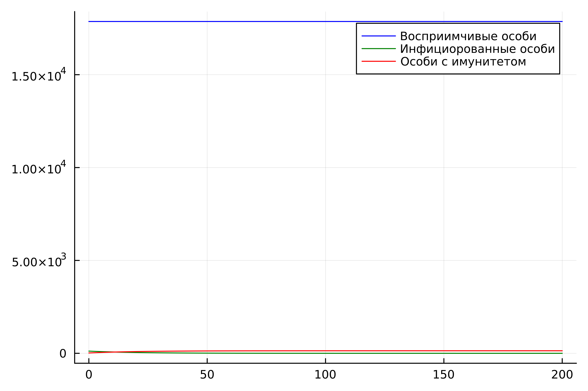
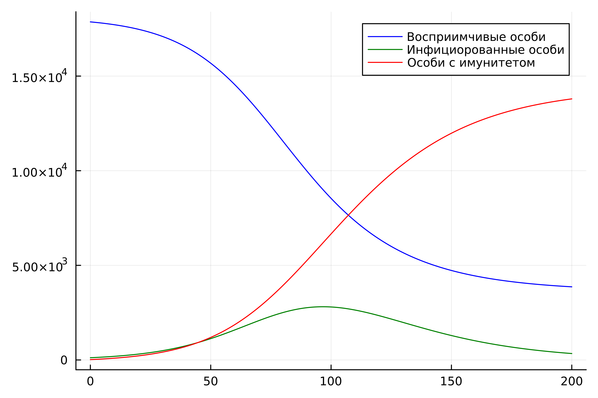

---
## Front matter
lang: ru-RU
title: Лабораторная работа №6
subtitle: Задача об эпидемии
author:
  - Хрусталев В.Н.
institute:
  - Российский университет дружбы народов, Москва, Россия

## i18n babel
babel-lang: russian
babel-otherlangs: english

## Formatting pdf
toc: false
toc-title: Содержание
slide_level: 2
aspectratio: 169
section-titles: true
theme: metropolis
header-includes:
 - \metroset{progressbar=frametitle,sectionpage=progressbar,numbering=fraction}
---

# Информация

## Цель работы

Исследовать модель SIR (задача об эпидемии)

## Задание

**Вариант [(1132222011 % 70) + 1] = 12**

## Задание

На одном острове вспыхнула эпидемия. Известно, что из всех проживающих
на острове ($N=18000$) в момент начала эпидемии ($t=0$) число заболевших людей
(являющихся распространителями инфекции) $I(0)=118$, А число здоровых людей с
иммунитетом к болезни $R(0)=18$.

## Задание

Таким образом, число людей восприимчивых к
болезни, но пока здоровых, в начальный момент времени $S(0)=N-I(0)- R(0)$.

Постройте графики изменения числа особей в каждой из трех групп.

## Задание

Рассмотрите, как будет протекать эпидемия в случае:
1) если $I(0)\leq I^*$;
2) если $I(0) > I^*$.

## Случай $I(0) < I^*$

Рассмотрим случай, когда число заболевших не превышает критического значения $I^*$, то есть считаем, что все больные изолированы и не заражают здоровых.

## Случай $I(0) < I^*$ | Реализация на Julia

```Julia
using Plots
using DifferentialEquations

N = 18000
I0 = 118 # заболевшие особи
R0 = 18 # особи с иммунитетом
S0 = N - I0 - R0 # здоровые, но восприимчивые особи
u0 = [S0, I0, R0]
p = [0.1, 0.05]
tspan = (0.0, 200.0)
```

## Случай $I(0) < I^*$ | Реализация на Julia

```Julia
function ode_fn(u,p,t)
    (S,I,R) = u
    (b, c) = p
    N = S+I+R
    dS = 0
    dI = -c*I
    dR = c*I
    return [dS, dI, dR]
end

prob = ODEProblem(ode_fn, u0, tspan, p)
sol = solve(prob, Tsit5(), saveat = 0.1)
```

## Случай $I(0) < I^*$ | Реализация на Julia 

```Julia
S = [u[1] for u in sol.u]
I = [u[2] for u in sol.u]
R = [u[3] for u in sol.u]
T = [t for t in sol.t]
plt = plot(dpi = 600, legend = :topright)
plot!(plt, T, S, label = "Восприимчивые особи", color = :blue)
plot!(plt, T, I, label = "Инфициорованные особи", color = :green)
plot!(plt, T, R, label = "Особи с имунитетом", color = :red)

savefig(plt, "lab06_1.png")
```

## Случай $I(0) < I^*$ | Динамика изменения числа людей в каждой из трех групп

{#fig:001 width=70%}

## Случай $I(0) > I^*$

Рассмотрим случай, когда число заболевших превышает критическое значения $I^*$, то есть считаем, что инфицирование способны заражать восприимчивых к болезни особей. 

## Случай $I(0) > I^*$ | Реализация на Julia

```Julia
using Plots
using DifferentialEquations

N = 18000
I0 = 118 # заболевшие особи
R0 = 18 # особи с иммунитетом
S0 = N - I0 - R0 # здоровые, но восприимчивые особи
u0 = [S0, I0, R0]
p = [0.1, 0.05]
tspan = (0.0, 200.0)
```

## Случай $I(0) > I^*$ | Реализация на Julia

```Julia
function ode_fn(u,p,t)
    (S,I,R) = u
    (b, c) = p
    N = S+I+R
    dS = -(b*S*I)/N
    dI = (b*S*I)/N -c*I
    dR = c*I
    return [dS, dI, dR]
end

prob = ODEProblem(ode_fn, u0, tspan, p)
sol = solve(prob, Tsit5(), saveat = 0.1)
```

## Случай $I(0) > I^*$ | Реализация на Julia 

```Julia
S = [u[1] for u in sol.u]
I = [u[2] for u in sol.u]
R = [u[3] for u in sol.u]
T = [t for t in sol.t]
plt = plot(dpi = 600, legend = :topright)
plot!(plt, T, S, label = "Восприимчивые особи", color = :blue)
plot!(plt, T, I, label = "Инфициорованные особи", color = :green)
plot!(plt, T, R, label = "Особи с имунитетом", color = :red)

savefig(plt, "lab06_2.png")
```

## Случай $I(0) > I^*$ | Динамика изменения числа людей в каждой из трех групп

{#fig:002 width=70%}

## Вывод

В ходе выполнения лабораторной работы я исследовал модель SIR.
