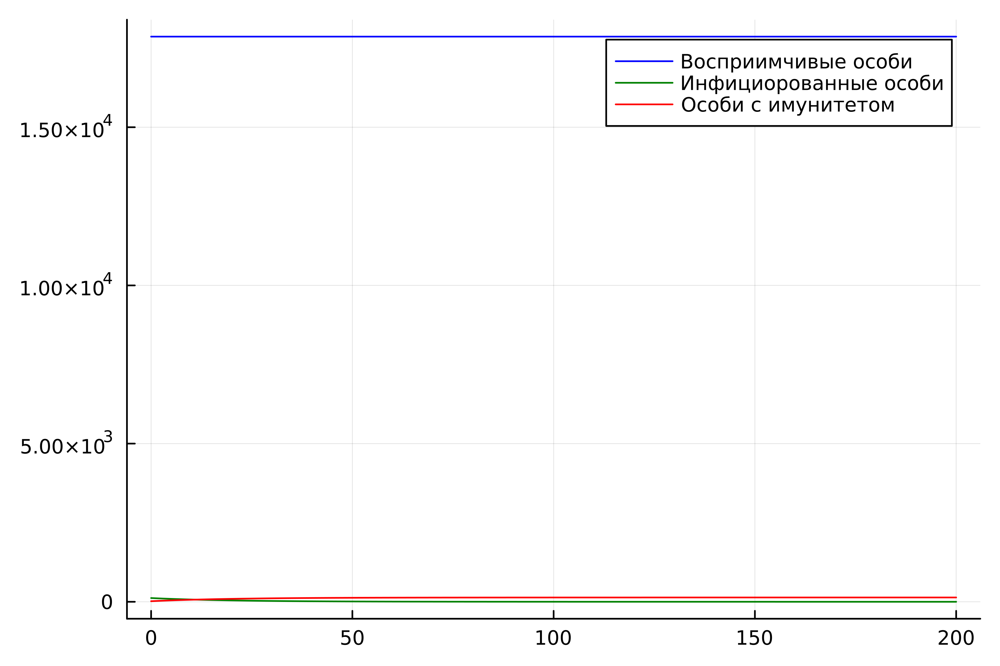
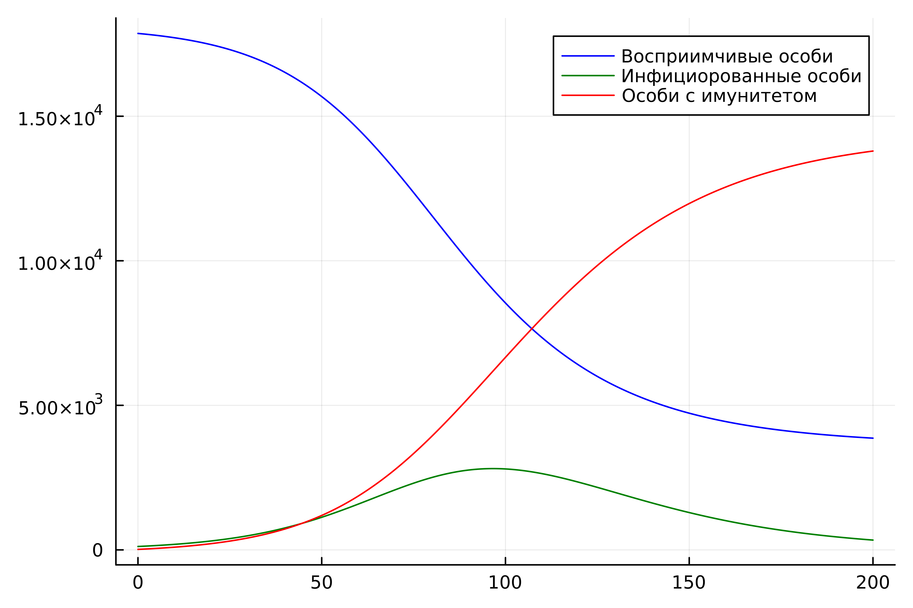

---
## Front matter
title: "Лабораторная работа №6"
subtitle: "Задача об эпидемии"
author: "Хрусталев Влад Николаевич"

## Generic otions
lang: ru-RU
toc-title: "Содержание"

## Bibliography
bibliography: bib/cite.bib
csl: pandoc/csl/gost-r-7-0-5-2008-numeric.csl

## Pdf output format
toc: true # Table of contents
toc-depth: 2
lof: true # List of figures
lot: true # List of tables
fontsize: 12pt
linestretch: 1.5
papersize: a4
documentclass: scrreprt
## I18n polyglossia
polyglossia-lang:
  name: russian
  options:
	- spelling=modern
	- babelshorthands=true
polyglossia-otherlangs:
  name: english
## I18n babel
babel-lang: russian
babel-otherlangs: english
## Fonts
mainfont: IBM Plex Serif
romanfont: IBM Plex Serif
sansfont: IBM Plex Sans
monofont: IBM Plex Mono
mathfont: STIX Two Math
mainfontoptions: Ligatures=Common,Ligatures=TeX,Scale=0.94
romanfontoptions: Ligatures=Common,Ligatures=TeX,Scale=0.94
sansfontoptions: Ligatures=Common,Ligatures=TeX,Scale=MatchLowercase,Scale=0.94
monofontoptions: Scale=MatchLowercase,Scale=0.94,FakeStretch=0.9
mathfontoptions:
## Biblatex
biblatex: true
biblio-style: "gost-numeric"
biblatexoptions:
  - parentracker=true
  - backend=biber
  - hyperref=auto
  - language=auto
  - autolang=other*
  - citestyle=gost-numeric
## Pandoc-crossref LaTeX customization
figureTitle: "Рис."
tableTitle: "Таблица"
listingTitle: "Листинг"
lofTitle: "Список иллюстраций"
lotTitle: "Список таблиц"
lolTitle: "Листинги"
## Misc options
indent: true
header-includes:
  - \usepackage{indentfirst}
  - \usepackage{float} # keep figures where there are in the text
  - \floatplacement{figure}{H} # keep figures where there are in the text
---

# Цель работы

Исследовать модель SIR (задача об эпидемии)

# Задание

**Вариант 12**

На одном острове вспыхнула эпидемия. Известно, что из всех проживающих
на острове ($N=18000$) в момент начала эпидемии ($t=0$) число заболевших людей
(являющихся распространителями инфекции) $I(0)=118$, А число здоровых людей с
иммунитетом к болезни $R(0)=18$. Таким образом, число людей восприимчивых к
болезни, но пока здоровых, в начальный момент времени $S(0)=N-I(0)- R(0)$.

Постройте графики изменения числа особей в каждой из трех групп.

Рассмотрите, как будет протекать эпидемия в случае:
1) если $I(0)\leq I^*$;
2) если $I(0) > I^*$.

# Теоретическое введение

Компартментальные модели являются очень общим методом моделирования. Они часто применяются к математическому моделированию инфекционных заболеваний. Население распределяется по отделениям с помощью меток – например, S, I, или R, (Susceptible, Infectious, or Recovered). Люди могут прогресс между отсеками. Порядок расположения меток обычно показывает структуру потоков между компартментами; например, SEIS означает восприимчивый, подверженный воздействию, инфекционный, затем снова восприимчивый[@wiki].

Зарождение таких моделей относится к началу 20 века, важными работами которого являются работы Росса в 1916 году Росс и Хадсон в 1917 году, Кермак и Маккендрик в 1927 г., и Кендалл в 1956 году. Модель Рид–Мороз также был важным и широко упускаемым из виду предком современных подходов к эпидемиологическому моделированию.

Модели чаще всего управляются с помощью обыкновенных дифференциальных уравнений (которые являются детерминированными), но также могут использоваться со стохастической (случайной) структурой, которая более реалистична, но гораздо сложнее в анализе.

Модели пытаются предсказать такие вещи, как распространение болезни, или общее число инфицированных, или продолжительность эпидемии, а также оценить различные эпидемиологические параметры, такие как репродуктивное число. Такие модели могут показать, насколько различаются вмешательства общественного здравоохранения могут повлиять на исход эпидемии, например, на то, какой метод является наиболее эффективным для выпуска ограниченного количества вакцин в данной популяции.


# Выполнение лабораторной работы

## Случай $I(0) <= I^*$

Рассмотрим случай, когда число заболевших не превышает критического значения $I^*$, то есть считаем, что все больные изолированы и не заражают здоровых.

### Реализация на Julia

```Julia
using Plots
using DifferentialEquations

N = 18000
I0 = 118 # заболевшие особи
R0 = 18 # особи с иммунитетом
S0 = N - I0 - R0 # здоровые, но восприимчивые особи
u0 = [S0, I0, R0]
p = [0.1, 0.05]
tspan = (0.0, 200.0)

function ode_fn(u,p,t)
    (S,I,R) = u
    (b, c) = p
    N = S+I+R
    dS = 0
    dI = -c*I
    dR = c*I
    return [dS, dI, dR]
end

prob = ODEProblem(ode_fn, u0, tspan, p)
sol = solve(prob, Tsit5(), saveat = 0.1)

S = [u[1] for u in sol.u]
I = [u[2] for u in sol.u]
R = [u[3] for u in sol.u]
T = [t for t in sol.t]
plt = plot(dpi = 600, legend = :topright)
plot!(plt, T, S, label = "Восприимчивые особи", color = :blue)
plot!(plt, T, I, label = "Инфициорованные особи", color = :green)
plot!(plt, T, R, label = "Особи с имунитетом", color = :red)

savefig(plt, "lab06_1.png")
```

В результате получаем следующий график динамики изменения числа особей в каждой из 3 групп (рис. [-@fig:001]). Видно, что численность Восприимчивых особей не меняется, по скольку мы рассматриваем случай, когда  все больные изолированные. Число больных уменьшается, а те кто выздоровел(часть) получает имунитет и число людей с иммунитетом увеличивается.


{#fig:001 width=70%}


## Случай $I(0) > I^*$

Рассмотрим случай, когда число заболевших превышает критическое значения $I^*$, то есть считаем, что инфицирование способны заражать восприимчивых к болезни особей. 

### Реализация на Julia

```Julia
using Plots
using DifferentialEquations

N = 18000
I0 = 118 # заболевшие особи
R0 = 18 # особи с иммунитетом
S0 = N - I0 - R0 # здоровые, но восприимчивые особи
u0 = [S0, I0, R0]
p = [0.1, 0.05]
tspan = (0.0, 200.0)

function ode_fn(u,p,t)
    (S,I,R) = u
    (b, c) = p
    N = S+I+R
    dS = -(b*S*I)/N
    dI = (b*S*I)/N -c*I
    dR = c*I
    return [dS, dI, dR]
end

prob = ODEProblem(ode_fn, u0, tspan, p)
sol = solve(prob, Tsit5(), saveat = 0.1)

S = [u[1] for u in sol.u]
I = [u[2] for u in sol.u]
R = [u[3] for u in sol.u]
T = [t for t in sol.t]
plt = plot(dpi = 600, legend = :topright)
plot!(plt, T, S, label = "Восприимчивые особи", color = :blue)
plot!(plt, T, I, label = "Инфициорованные особи", color = :green)
plot!(plt, T, R, label = "Особи с имунитетом", color = :red)

savefig(plt, "lab06_2.png")
```

В результате получаем следующий график динамики изменения числа особей в каждой из 3 групп (рис. [-@fig:002]). Видно, что численность Восприимчивых особей уменьшается, по скольку мы рассматриваем случай, когда больные заражают здоровых. Число больных сначала увеличивается, а потом уменьшается, так как люди начинают выздоравливать и приобретать иммунитет.


{#fig:002 width=70%}

# Выводы

В ходе выполнения лабораторной работы я исследовал модель SIR.

# Список литературы{.unnumbered}

::: {#refs}
:::