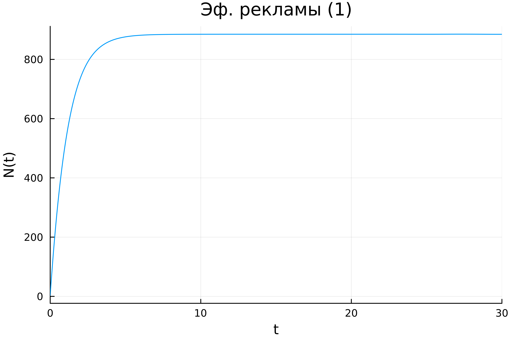
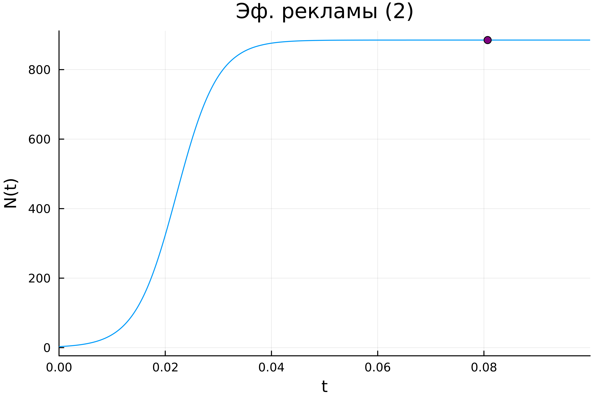
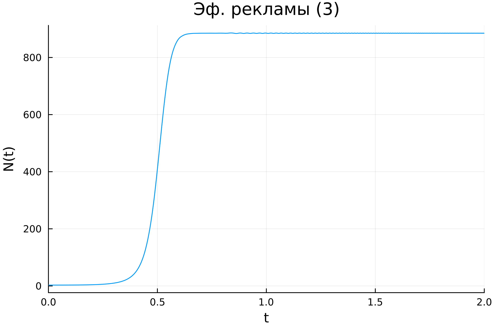

---
## Front matter
lang: ru-RU
title: Лабораторная работа №7
subtitle: Эффективность рекламы
author:
  - Хрусталев В.Н.
institute:
  - Российский университет дружбы народов, Москва, Россия

## i18n babel
babel-lang: russian
babel-otherlangs: english

## Formatting pdf
toc: false
toc-title: Содержание
slide_level: 2
aspectratio: 169
section-titles: true
theme: metropolis
header-includes:
 - \metroset{progressbar=frametitle,sectionpage=progressbar,numbering=fraction}
---

# Информация

## Цель работы

Исследовать модель эффективности рекламы

## Задание

**Вариант [(1132222011 % 70) + 1] = 12**

## Задание

Построить график распространения рекламы, математическая модель которой описывается
следующим уравнением:

1. $\dfrac{dn}{dt} = (0.83 + 0.00013n(t))(N-n(t))$

## Задание

2. $\dfrac{dn}{dt} = (0.000024 + 0.29n(t))(N-n(t))$

3. $\dfrac{dn}{dt} = (0.5t + 0.3*t*n(t))(N-n(t))$

## Задание

При этом объем аудитории  $N = 885$, в начальный момент о товаре знает 3 человек. Для случая 2 определить в какой момент времени скорость распространения рекламы будет иметь максимальное значение.

## Случай 1 | Реализация на Julia

```Julia
using DifferentialEquations, Plots;
N0 = 885
n0 = 3
tspan = (0.0, 30.0)
function ode_fn(n, p, t)
  du = (0.83 + 0.00013 * n)*(N0-n)
  return du
end
prob = ODEProblem(ode_fn, n0, tspan)
sol = solve(prob, Tsit5(), saveat = 0.01)
plt = plot(sol, dpi = 600, title = "Эф. рекламы (1)", yaxis = "N(t)", legend=false)
savefig(plt, "1.png")
```

## Случай 1 | График распространения рекламы

{#fig:001 width=70%}

## Случай 2 | Реализация на Julia

```Julia
using DifferentialEquations, Plots;

N0 = 885
n0 = 3
tspan = (0.0, 0.1)

function ode_fn(n, p, t)
  du = (0.000024 + 0.29 * n)*(N0-n)
  return du
end

prob = ODEProblem(ode_fn, n0, tspan)
sol = solve(prob, Tsit5(), saveat = 0.0001)
```

## Случай 2 | Реализация на Julia

```Julia
max_dn = 0;
max_dn_t = 0;
max_dn_n = 0;

for (i,t) in enumerate(sol.t)
  if sol(t) > max_dn
    global max_dn = sol(t)
    global max_dn_t = t
    global max_dn_n = sol.u[i]
  end
end
```

## Случай 2 | Реализация на Julia

```Julia
plt = plot(sol, dpi = 600, title = "Эф. рекламы (2)", yaxis = "N(t)", legend=false)
scatter!(plt, (max_dn_t, max_dn_n), c=:purple, legend=false)
savefig(plt, "2.png")
```

## Случай 2 | График распространения рекламы

{#fig:002 width=70%}

## Случай 3 | Реализация на Julia

```Julia
using DifferentialEquations, Plots;
N0 = 885
n0 = 3
tspan = (0.0, 2.0)
function ode_fn(n, p, t)
  du = (0.5 * t * + 0.3 * t * n)*(N0-n)
  return du
end
prob = ODEProblem(ode_fn, n0, tspan)
sol = solve(prob, Tsit5(), saveat = 0.001)
plt = plot(sol, dpi = 600, title = "Эф. рекламы (3)", yaxis = "N(t)", legend=false)
savefig(plt, "3.png")
```

## Случай 3 | График распространения рекламы

{#fig:003 width=70%}

## Вывод

В ходе выполнения лабораторной работы я исследовал модель эфективности рекламы.
