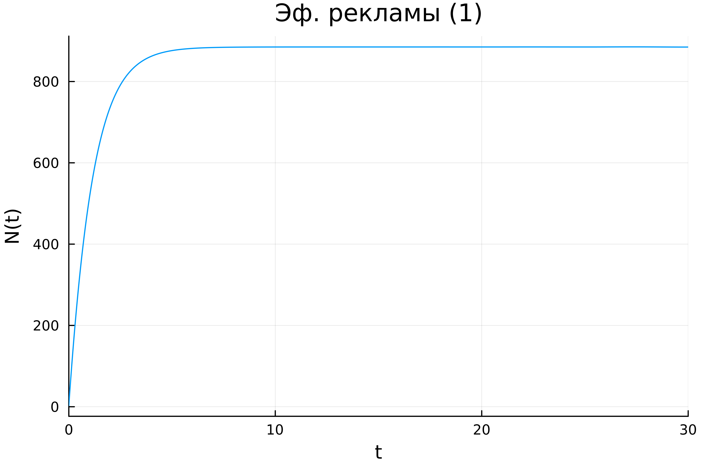
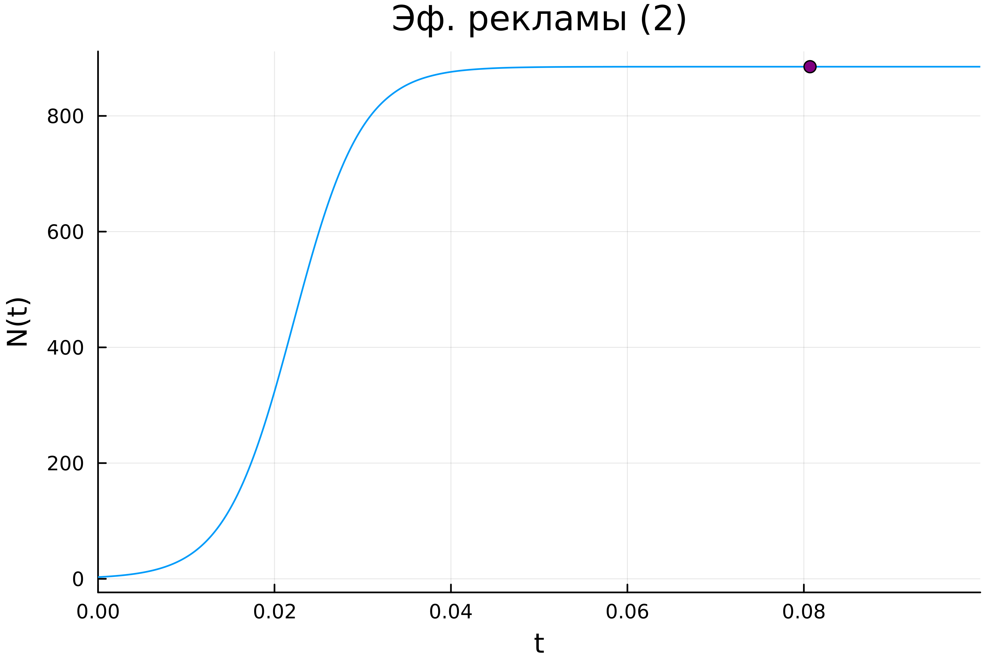
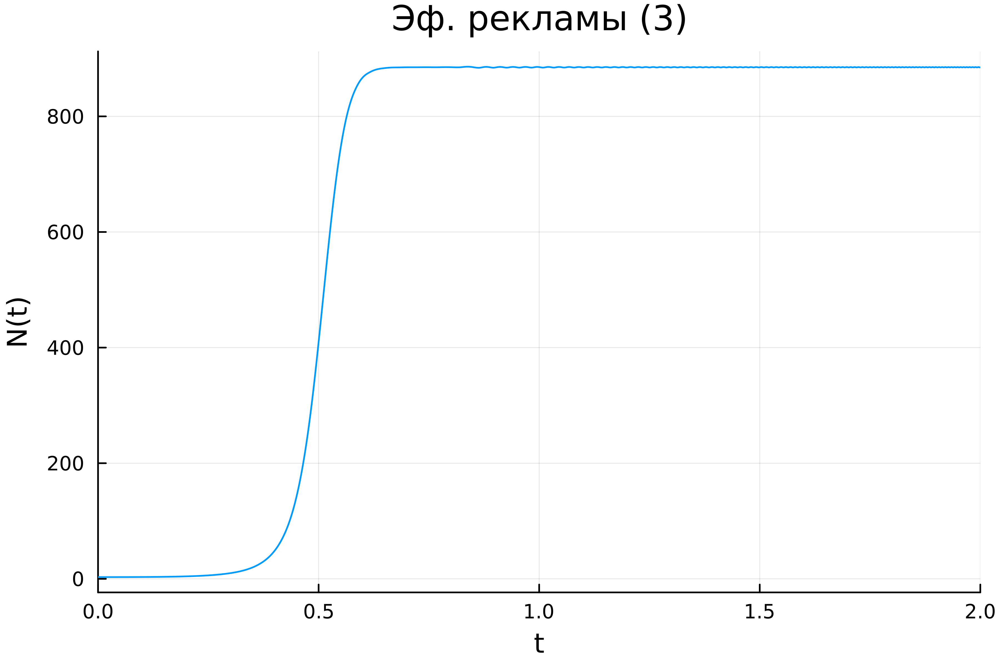

---
## Front matter
title: "Лабораторная работа №7"
subtitle: "Эффективность рекламы"
author: "Хрусталев Влад Николаевич"

## Generic otions
lang: ru-RU
toc-title: "Содержание"

## Bibliography
bibliography: bib/cite.bib
csl: pandoc/csl/gost-r-7-0-5-2008-numeric.csl

## Pdf output format
toc: true # Table of contents
toc-depth: 2
lof: true # List of figures
lot: true # List of tables
fontsize: 12pt
linestretch: 1.5
papersize: a4
documentclass: scrreprt
## I18n polyglossia
polyglossia-lang:
  name: russian
  options:
	- spelling=modern
	- babelshorthands=true
polyglossia-otherlangs:
  name: english
## I18n babel
babel-lang: russian
babel-otherlangs: english
## Fonts
mainfont: IBM Plex Serif
romanfont: IBM Plex Serif
sansfont: IBM Plex Sans
monofont: IBM Plex Mono
mathfont: STIX Two Math
mainfontoptions: Ligatures=Common,Ligatures=TeX,Scale=0.94
romanfontoptions: Ligatures=Common,Ligatures=TeX,Scale=0.94
sansfontoptions: Ligatures=Common,Ligatures=TeX,Scale=MatchLowercase,Scale=0.94
monofontoptions: Scale=MatchLowercase,Scale=0.94,FakeStretch=0.9
mathfontoptions:
## Biblatex
biblatex: true
biblio-style: "gost-numeric"
biblatexoptions:
  - parentracker=true
  - backend=biber
  - hyperref=auto
  - language=auto
  - autolang=other*
  - citestyle=gost-numeric
## Pandoc-crossref LaTeX customization
figureTitle: "Рис."
tableTitle: "Таблица"
listingTitle: "Листинг"
lofTitle: "Список иллюстраций"
lotTitle: "Список таблиц"
lolTitle: "Листинги"
## Misc options
indent: true
header-includes:
  - \usepackage{indentfirst}
  - \usepackage{float} # keep figures where there are in the text
  - \floatplacement{figure}{H} # keep figures where there are in the text
---

# Цель работы

Исследовать модель эффективности рекламы

# Задание

**Вариант 12**

Построить график распространения рекламы, математическая модель которой описывается
следующим уравнением:

1. $\dfrac{dn}{dt} = (0.83 + 0.00013n(t))(N-n(t))$

2. $\dfrac{dn}{dt} = (0.000024 + 0.29n(t))(N-n(t))$

3. $\dfrac{dn}{dt} = (0.5t + 0.3*t*n(t))(N-n(t))$

При этом объем аудитории  $N = 885$, в начальный момент о товаре знает 3 человек. Для случая 2 определить в какой момент времени скорость распространения рекламы будет иметь максимальное значение.

# Теоретическое введение

Пусть некая фирма начинает рекламировать новый товар. Необходимо, чтобы прибыль от будущих продаж покрывала издержки на дорогостоящую кампанию. Ясно, что вначале расходы могут превышать прибыль, поскольку лишь малая часть потенциальных покупателей будет информирована о новом товаре. Затем, при увеличении числа продаж, уже возможно рассчитывать на заметную прибыль, и, наконец, наступит момент, когда рынок насытится, и рекламировать товар далее станет бессмысленно.

Модель рекламной кампании основывается на следующих основных предположениях. Считается, что величина $\dfrac{dN}{dt}$ — скорость изменения со временем числа потребителей, узнавших о товаре и готовых купить его ($t$ — время, прошедшее с начала рекламной кампании, $N(t)$ – число уже информированных клиентов), — пропорциональна числу покупателей, еще не знающих о нем, т. е. величине $\alpha_1(t)(N_0 - N(t))$, где $N_0$ - общее число покупателей (емкость рынка),характеризует интенсивность рекламной кампании. Предполагается также, что узнавшие о товаре потребители распространяют полученную информацию среди неосведомленных, выступая как бы в роли дополнительных рекламных агентов фирмы. Их вклад равен величине $\alpha_2(t)N(t)(N_0-N(t))$, которая тем больше, чем больше число агентов. Величина $\alpha_2$ характеризует степень общения покупателей между собой [@stud].

В итоге получаем уравнение

$$\dfrac{dn}{dt} = (\alpha_1+\alpha_2 n(t))(N-n(t))$$


# Выполнение лабораторной работы

## Случай 1

### Реализация на Julia

```Julia
using DifferentialEquations, Plots;

N0 = 885
n0 = 3
tspan = (0.0, 30.0)

function ode_fn(n, p, t)
  du = (0.83 + 0.00013 * n)*(N0-n)
  return du
end

prob = ODEProblem(ode_fn, n0, tspan)
sol = solve(prob, Tsit5(), saveat = 0.01)

plt = plot(sol, dpi = 600, title = "Эф. рекламы (1)", yaxis = "N(t)", legend=false)
savefig(plt, "1.png")
```

В результате получаем следующий график (рис. [-@fig:001]). Поскольку у нас $\alpha_1 >> \alpha_2$ мы получили модель Мальтуса.


{#fig:001 width=70%}


## Случай 2

Поскольку требуется найти момент времени, в который скорость распространения рекламы имеет максимальныое значение. Первая производная - это показатель скорости =>  надо найти максимальное значение $\dfrac{dn}{dt}$ на заданном промежутке времени.

### Реализация на Julia

```Julia
using DifferentialEquations, Plots;

N0 = 885
n0 = 3
tspan = (0.0, 0.1)

function ode_fn(n, p, t)
  du = (0.000024 + 0.29 * n)*(N0-n)
  return du
end

prob = ODEProblem(ode_fn, n0, tspan)
sol = solve(prob, Tsit5(), saveat = 0.0001)

max_dn = 0;
max_dn_t = 0;
max_dn_n = 0;

for (i,t) in enumerate(sol.t)
  if sol(t) > max_dn
    global max_dn = sol(t)
    global max_dn_t = t
    global max_dn_n = sol.u[i]
  end
end


plt = plot(sol, dpi = 600, title = "Эф. рекламы (2)", yaxis = "N(t)", legend=false)
scatter!(plt, (max_dn_t, max_dn_n), c=:purple, legend=false)
savefig(plt, "2.png")
```

В результате получаем следующий график (рис. [-@fig:002]). Поскольку у нас $\alpha_1 << \alpha_2$ мы получили логистическую кривую.


{#fig:002 width=70%}

## Случай 3

### Реализация на Julia

```Julia
using DifferentialEquations, Plots;

N0 = 885
n0 = 3
tspan = (0.0, 2.0)

function ode_fn(n, p, t)
  du = (0.5 * t * + 0.3 * t * n)*(N0-n)
  return du
end

prob = ODEProblem(ode_fn, n0, tspan)
sol = solve(prob, Tsit5(), saveat = 0.001)


plt = plot(sol, dpi = 600, title = "Эф. рекламы (3)", yaxis = "N(t)", legend=false)
savefig(plt, "3.png")
```

В результате получаем следующий график (рис. [-@fig:003]). 


{#fig:003 width=70%}

# Выводы

В ходе выполнения лабораторной работы я исследовал модель эфективности рекламы.

# Список литературы{.unnumbered}

::: {#refs}
:::