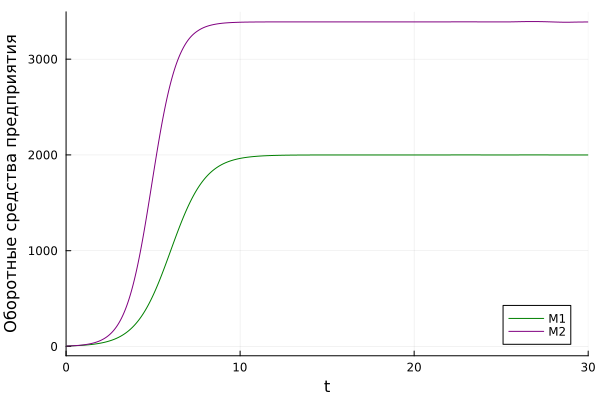
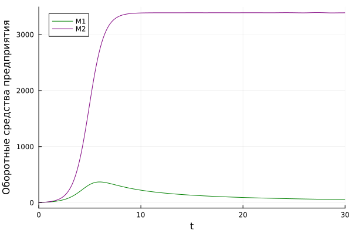

---
## Front matter
lang: ru-RU
title: Лабораторная работа №8
subtitle: Модель конкуренции двух фирм
author:
  - Хрусталев В.Н.
institute:
  - Российский университет дружбы народов, Москва, Россия

## i18n babel
babel-lang: russian
babel-otherlangs: english

## Formatting pdf
toc: false
toc-title: Содержание
slide_level: 2
aspectratio: 169
section-titles: true
theme: metropolis
header-includes:
 - \metroset{progressbar=frametitle,sectionpage=progressbar,numbering=fraction}
---

# Информация

## Цель работы

Исследовать математическую модель конкуренции двух фирм.

## Задание

**Вариант [(1132222011 % 70) + 1] = 12**

## Задание

*Случай 1* 

$$\begin{cases}                                 
  \dfrac{dM_1}{d\theta} = M_1-\dfrac{b}{c_1}M_1M_2-\dfrac{a_1}{c_1}M_1^2,\\
  \dfrac{dM_2}{d\theta} = \dfrac{c_2}{c_1}M2-\dfrac{b}{c_1}M_1M_2-\dfrac{a_1}{c_1}M_2^2,
\end{cases}
$$

где $a_1=\dfrac{p_{cr}}{\tau_{1}^2\tilde p_1^2Nq}, \, \, a_2=\dfrac{p_{cr}}{\tau_{2}^2\tilde p_2^2Nq}, \, \, b=\dfrac{p_{cr}}{\tau_{1}^2\tilde p_1^2\tau_{2}^2\tilde p_2^2Nq}, \, \, c_1=\dfrac{p_{cr} - \tilde{p_1}}{\tau_{1}\tilde p_1}, \, \, c_2=\dfrac{p_{cr} - \tilde{p_1}}{\tau_{2}\tilde p_2}$

Также введена нормировка $t=c_1\theta$.

## Задание

$$\begin{cases}                                 
  \dfrac{dM_1}{d\theta} = M_1-(\dfrac{b}{c_1}+0.0003)M_1M_2-\dfrac{a_1}{c_1}M_1^2,\\
  \dfrac{dM_2}{d\theta} = \dfrac{c_2}{c_1}M2-\dfrac{b}{c_1}M_1M_2-\dfrac{a_1}{c_1}M_2^2,
\end{cases}
$$

## Задание

$$M_0^1=4.8, \, M_0^2=4.5,$$
$$p_{cr}=12, \,N=39, q=1$$
$$\tau_1=19, \, \tau_2=29,$$
$$\tilde{p_1}=7.9, \, \tilde{p_2}=5.8$$

## Задача

*Обозначения:*

* $N$ -- число потребителей производимого продукта.
* $\tau$ -- длительность производственного цикла
* $p$ -- рыночная цена товара
* $\tilde{p}$ -- себестоимость продукта, то есть переменные издержки на производство единицы
продукции.
* $q$ -- максимальная потребность одного человека в продукте в единицу времени
* $\theta = \dfrac{t}{c_1}$ -- безразмерное время

## Задание

1. Построить графики изменения оборотных средств фирмы 1 и фирмы 2 без
учета постоянных издержек и с веденной нормировкой для случая 1.
2. Построить графики изменения оборотных средств фирмы 1 и фирмы 2 без
учета постоянных издержек и с веденной нормировкой для случая 2.

## Случай 1 | Реализация на Julia

```Julia
using Plots, DifferentialEquations
p_cr = 12
t1 = 19
p1 = 7.9
t2 = 29
p2 = 5.8
N = 39
q = 1
```

## Случай 1 | Реализация на Julia

```Julia
a1 = p_cr/(t1^2*p1^2*N*q)
a2 = p_cr/(t2^2*p2^2*N*q)
b = p_cr/(t1^2*t2^2*p1^2*p2^2*N*q)
c1 = (p_cr-p1)/(t1*p1)
c2 = (p_cr-p2)/(t2*p2)
```

## Случай 1 | Реализация на Julia

```Julia
u0 = [4.9,4.4]
p = [a1,a2,b,c1,c2]
tspan = (0.0,30.0)
```

## Случай 1 | Реализация на Julia

```Julia
function ode_fn(u,p,t)
  M01, M02 = u
  a1, a2, b, c1, c2 = p
  M1 = M01 -(b/c1)*M01*M02 - (a1/c1)*M01^2
  M2 = (c2/c1)*M02-(b/c1)*M01*M02-(a2/c1)*M02^2
  return [M1, M2]
end
```

## Случай 1 | Реализация на Julia

```Julia
prob = ODEProblem(ode_fn, u0, tspan, p)
sol = solve(prob, Tsit5(), saveat = 0.01)
plt = plot(sol, yaxis = "Оборотные средства предприятия", label = ["M1" "M2"], c = ["green" "purple"])
savefig(plt, "lab08_1.png")
```

## Случай 1 | График изменения оборотных средств

{#fig:001 width=70%}

## Случай 2 | Реализация на Julia

```Julia
using Plots, DifferentialEquations
p_cr = 12
t1 = 19
p1 = 7.9
t2 = 29
p2 = 5.8
N = 39
q = 1
```

## Случай 2 | Реализация на Julia

```Julia
a1 = p_cr/(t1^2*p1^2*N*q)
a2 = p_cr/(t2^2*p2^2*N*q)
b = p_cr/(t1^2*t2^2*p1^2*p2^2*N*q)
c1 = (p_cr-p1)/(t1*p1)
c2 = (p_cr-p2)/(t2*p2)
```

## Случай 2 | Реализация на Julia

```Julia
u0 = [4.9,4.4]
p = [a1,a2,b,c1,c2]
tspan = (0.0,30.0)
```

## Случай 2 | Реализация на Julia

```Julia
function ode_fn(u,p,t)
  M01, M02 = u
  a1, a2, b, c1, c2 = p
  M1 = M01 - ((b/c1)+0.0003)*M01*M02-(a1/c1)*M01^2
  M2 = (c2/c1)*M02-(b/c1)*M01*M02-(a2/c1)*M02^2
  return [M1, M2]
end
```

## Случай 2 | Реализация на Julia

```Julia
prob = ODEProblem(ode_fn, u0, tspan, p)
sol = solve(prob, Tsit5(), saveat = 0.01)
plt = plot(sol, yaxis = "Оборотные средства предприятия", label = ["M1" "M2"], c = ["green" "purple"])
savefig(plt, "lab08_1.png")
```

## Случай 2 | График изменения оборотных средств

{#fig:002 width=70%}

## Вывод

В ходе выполнения лабораторной работы я исследовал модель конуренции двух фирм.